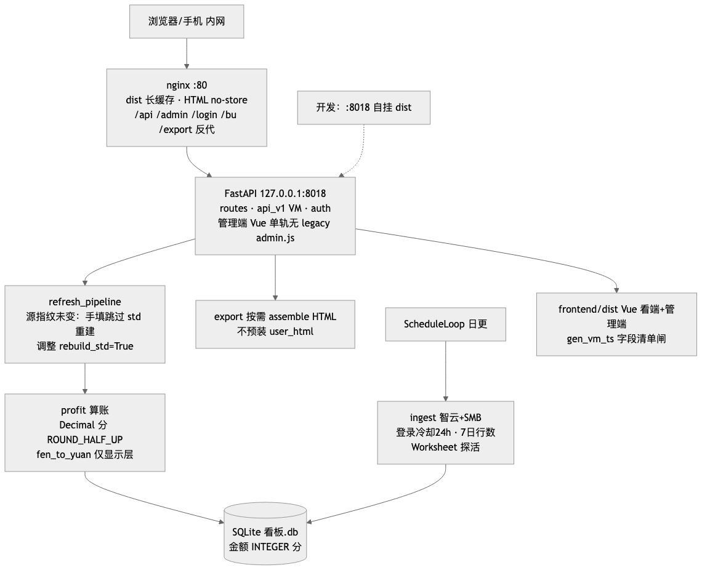
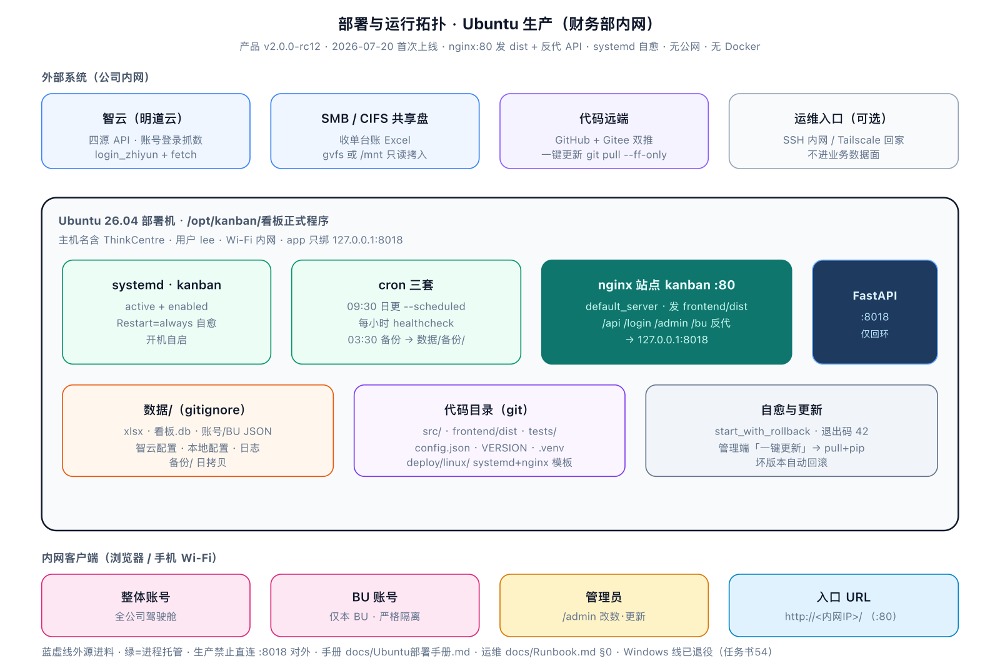
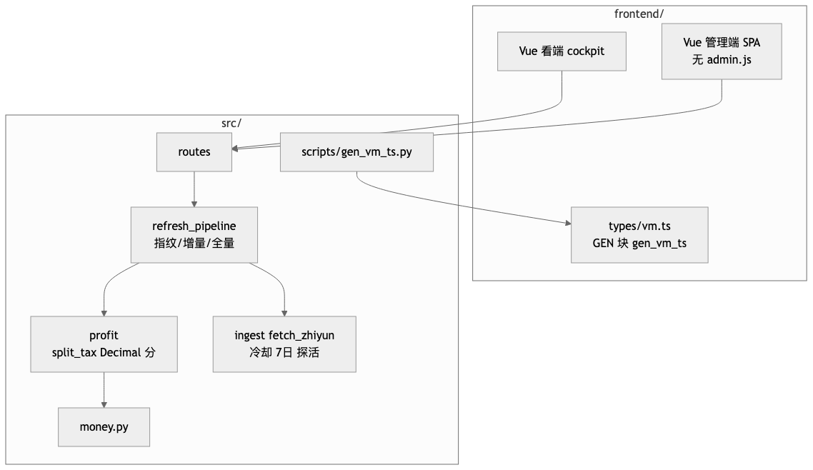
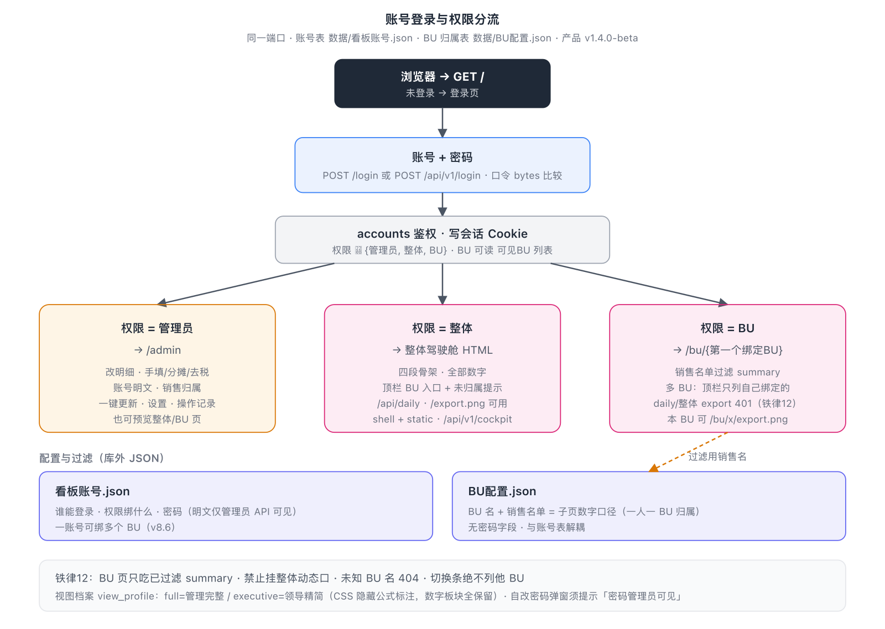
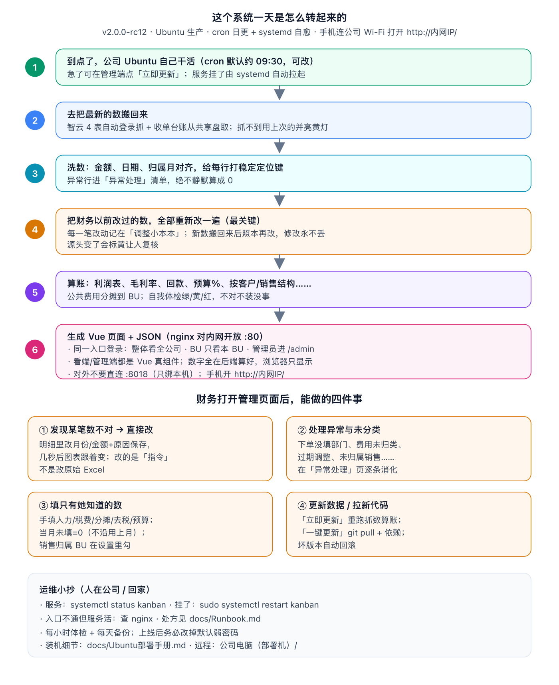
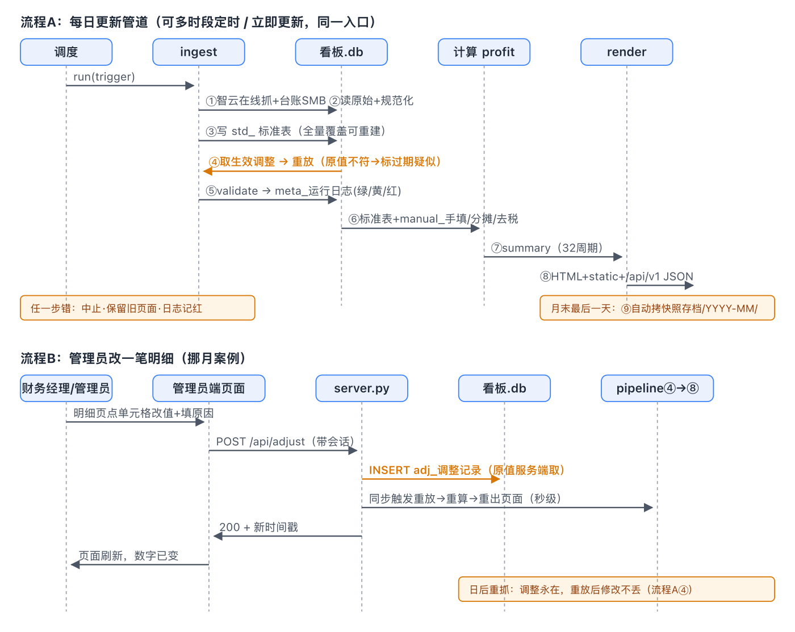
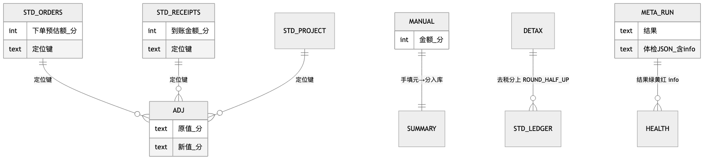

# 甲骨易智能经营罗盘

**轻量自建经营利润驾驶舱** —— 每天自动抓数、算到税前利润，内网/手机可看。  
Python · SQLite · FastAPI · **Vue3(dist) + API v1(VM)** · ECharts/SVG 双路径 · 前端零金额运算

| 版本 | 架构 | 质量 |
|:---:|:---:|:---:|
| **v2.0.0-beta** | nginx → Vue(dist) → API v1(VM) → domain 模块 → 存储(SQLite) | 红线 32 周期 · 明文密码+踢会话 · 口径配置引擎 · 明细白名单 |

```bash
python run.py             # 抓数 → 建库 → 算账 → 出 HTML
python run.py --serve     # 内网双端服务（默认 :8018）
KANBAN_OFFLINE=1 sh tests/run_verify.sh   # 一键全绿验证
```

---

## 这是什么

语言服务公司财务/管理层要用的**实时利润看板**：

- 脱离 Excel，每天自动更新一次即可  
- 管理利润表算到**税前利润**（确认口径比财务记账更前置）  
- 科技风暗色界面（可切浅色），手机连内网就能看  
- **同一入口账号分流**：整体 / 各 BU / 管理员，不是多个裸链接  

| 角色 | 入口 | 能做什么 |
|------|------|----------|
| 管理层（整体） | `/` 登录 · 权限=整体 | 全公司 KPI、利润表、结构、排名；进各 BU；导出 PNG |
| BU 负责人 | `/` 登录 · 权限=某 BU | 只看本 BU（销售名单过滤，**跨 BU 不泄漏**） |
| 财务管理员 | `/admin` | 改明细、手填/分摊/去税、预算、账号、销售归属、一键更新 |

**设计铁律**：前端**不做任何金额运算**。年/季/月/任意区间的数字全部在 Python 预渲染好，浏览器只负责显示切换。

---

## 系统架构

> **图集与代码对齐说明（2026-07-18 · v2.0.0-beta · stage54p5）**  
> 逻辑链 **nginx → Vue(dist) → API v1(VM) → domain/profit·db → SQLite**。  
> **看端**仅 Vue（`static/shell*.html` 已删）；**管理端** Vue SPA（`admin.html` 重定向）。  
> **`KANBAN_FRONTEND`** 默认 `vue`（`config.json`）；`KANBAN_OFFLINE=1` 测回归。  
> **生产** = nginx 发 dist + 反代（`deploy/linux/nginx-kanban.conf`）；**简易** = `run.py --serve`。  
> 真组件无 v-html；明细白名单；明文密码 + 改密踢会话。Windows 手册已删。  
> 手册：`docs/Ubuntu部署手册.md` · `docs/Runbook.md` · 接口：`方案与文档/软件工程文档/2_设计/07_HTTP接口清单_全端点.md`。

五层单向数据流（展示层 = Vue 真组件 + 版本化结构化 VM）。换数据源只动抓数层；库只给后端碰；抓失败永不中断管道。

### 开发 vs 部署

| 模式 | 怎么起 | 适用 |
|------|--------|------|
| **开发** | 终端1 `python run.py --serve`；终端2 `cd frontend && npm run dev`（vite proxy `/api→8018`） | 热更新 |
| **简易预览** | `KANBAN_OFFLINE=1 python run.py --serve`（单进程发 dist+API） | 本机开发 |
| **生产 Ubuntu** | nginx:80 → dist + 反代 `127.0.0.1:8018` | **唯一**生产架构 |

### 1. 逻辑架构（主图）



```
① 抓数    智云四源自动登录抓 + 收单台账 SMB + 管理端表单手填
    ↓ 进料口：数据/ 目录（6 个 xlsx + 配置，不进 git）
② 清洗    规范化 → 行哈希定位键 → 重放人工调整
③ 存储    SQLite（std_/adj_/manual_/meta_/cfg_）· 读连接 mode=ro
④ 计算    domain / profit·db 包 re-export · summary（32 周期红线）
⑤ 展示    看端：Vue dist only（无 shell.html）← GET /api/v1/vm/*
          管理端：Vue SPA（Element Plus）；static/admin/admin.html 仅重定向 /admin
          账号明文管理端👁 · 口径配置 UI 已于任务书54 下线
```

| 契约 | 含义 |
|------|------|
| 进料口唯一接缝 | 换源/换抓取方式只动 ①，下游不动 |
| 库是后端私产 | 浏览器只经 HTTP，从不直连 SQLite |
| 抓数可降级 | 失败 → 沿用本地副本 + 体检黄，管道继续跑 |

### 2. 部署与运行拓扑



Ubuntu：`deploy/linux/start_with_rollback.sh` 看门狗常驻 `--serve` · cron `--scheduled` · 浏览器访问。

### 3. 模块与组件（对齐 `src/`）



### 4. 账号登录与权限分流



### 5. 每天怎么跑（大白话）



### 6. 关键时序 · 数据模型





ER 已对齐 `src/schema.py` 全表：`std_*` 五表 + `adj_调整` + `manual_手填/手填BU/分摊比例/去税率/预算/配置变更/历史` + `meta_运行日志`；账号/BU 在 JSON 不在库。

---

## 6 个数据源

| 源 | 提供 | 怎么来 |
|----|------|--------|
| 项目明细（智云） | 收入、系统直接成本 | 自动登录在线抓 |
| 内部译员（智云） | 从成本中减出的内部人力 | 自动抓 + 行数护栏 |
| 下单（智云） | 下单额、部门/销售排名 | 自动抓 |
| 回款记录（智云） | 到账额、客户排名 | 自动抓 |
| 收单台账（Excel） | 五类期间费用 | SMB 共享盘（不可达用本地副本） |
| 手填与调整 | 人力/生产成本补充等 | 管理端表单（**当月未填 = 0**） |

仓库不含业务数据：`数据/` 整目录 gitignore。

---

## 利润怎么算

`config.json` 是税率与费用分类的唯一配置源。

```
收入(不含税)  = 交付额 ÷ 1.06
生产成本      = 系统直接成本 − 内部译员 + 手填 − 直接成本增值税(默认0)
毛利          = 收入 − 生产成本
五类期间费用  = 手填人力 + 台账费用（营销/管理/固定运营/研发/财务）
附加税费      = 增值税 × 12%（增值税 = 不含税收入 × 6%）
税前利润      = 毛利 − 五类费用 − 附加税费 + 其他损益
```

要点：

- **调整可重放**：改明细 = 写指令，不改原始；每次重抓后自动重放  
- **公共费用按月分摊**到 BU（合计可 &lt; 100%，残留留公司层）  
- **费用去税率**按类别手填（空 = 不去税）  
- 每轮更新有数据体检（绿 / 黄 / 红）

---

## 页面长什么样

**用户端四段**

1. **基本情况** — 收入 / 毛利 / 税前利润 / 下单 / 回款 KPI  
2. **经营利润** — 趋势图 · 管理利润表（可下钻）· 费用构成 · 回款  
3. **收入与毛利结构** — 按客户 / 按销售 + 集中度  
4. **资金与回款** — 回款情况 + 下单/回款排名（支持任意日期段）

顶部：年 / 季 / 月日历切换 · 深浅色 · 体检徽章 · 整页 PNG 导出  

**管理端**：明细改数 · 手填/分摊/去税 · 预算 · 异常处理 · 销售归属 · 账号权限 · 一键更新  

**一键更新**：`git pull --ff-only` → 依赖变了自动 pip（清华镜像）→ 看门狗重启；坏版本自愈回滚。用 `deploy/linux/start_with_rollback.sh` 起服务。

---

## v2.0 前后端（任务书46）

- 默认 **Vue3**（`frontend/dist`，`KANBAN_FRONTEND=vue`）；legacy 壳可 `KANBAN_FRONTEND=legacy`
- **VM 契约**：`GET /api/v1/vm/cockpit` · `/api/v1/vm/bu/{name}`（显示串 + 图表序列；铁律2）
- 图表：ECharts（主题取 theme.css 变量）+ 后端 SVG 保留（导出/legacy）
- 安全：明文密码（管理端👁）· 改密踢会话 · 登录防爆破 · authz · 访问审计

```
frontend/dist              Vue SPA（/app 静态资源）
static/css/theme.css       唯一视觉源
static/shell.html          legacy 壳 → fragments + page.js
GET /api/v1/vm/cockpit     ViewModel（数字 ≡ extract_numbers/golden）
GET /api/v1/cockpit/fragments  legacy 碎片（deprecated 保留）
```

### v1.4/v1.5 历史路径

```
static/js/cockpit.js · cockpit-bu.js · assemble/
GET /api/v1/cockpit · /fragments · /bu/{name}
```

说明：[API 契约策略](docs/api/契约与兼容策略.md) · [v1.4 交付说明](docs/v1.4前后端分离交付说明.md)

---

## 快速开始

```bash
git clone https://github.com/EvanLee2004/BI.git && cd BI
# 国内镜像：git clone https://gitee.com/Lee157/oracleeasy--bi.git && cd oracleeasy--bi

python -m venv .venv
.venv/bin/pip install -r requirements.txt
.venv/bin/playwright install chromium   # 导出 PNG + 智云自动登录

# 把 6 个数据文件放进 数据/（见 数据/README.md；仓库不带数据）
python run.py             # 更新一次
python run.py --serve     # 起服务（KANBAN_PORT 可覆盖端口）
```

| 项 | 说明 |
|----|------|
| 默认账号 | 管理员 `lushasha` / `kanban2026`；查看账号初始 `8888` → **上线前改掉** |
| 账号文件 | `数据/看板账号.json`（明文、不进 git；缺则自动 seed） |
| 智云账号 | 管理端 → 设置页填写 |
| Ubuntu 装机 | [docs/Ubuntu部署手册.md](docs/Ubuntu部署手册.md) |
| 测/正式切换 | 只改 `config.json` 的 `data_dir` |

---

## 代码地图

```
run.py / config.json / VERSION
static/                 # v1.4 外置 CSS/JS/壳
src/
  ingest/               # 抓数 + 清洗管道
  profit.py             # ★ P&L 纯函数
  api_v1.py             # 驾驶舱 JSON
  db.py / schema.py     # SQLite
  render.py / server.py # 页面 + FastAPI
  accounts.py / bu.py   # 账号与 BU 归属
  updater.py            # 一键更新 + 看门狗
tests/  docs/  golden/
```

---

## 质量与发布

- **回归红线**：库算 == 文件直算，32 周期数字一分不差  
- **golden 全等**：`/api/v1/cockpit` 的 `numbers` 与基准 JSON 全等  
- **前端不算数**：产物里出现 `toFixed` / `parseFloat` 即测挂  
- 铁律全文见 [CLAUDE.md](CLAUDE.md)  
- 分支：`main` 唯一发布线；push 前核无真实金额 / 客户名 / 账号进库  

---

## 文档与设计图

### 标准软件工程图集（当前代码 · PNG 可渲染）

| 图 | 软工类型 | 文件 | 对齐状态 |
|----|----------|------|----------|
| 系统逻辑架构 | 架构 / 上下文 | [architecture.png](docs/images/architecture.png) | ✅ v1.5 = v1.4.0-beta |
| 部署运行拓扑 | 部署图 | [deploy.png](docs/images/deploy.png) | ✅ 看门狗·计划任务·内网 |
| 模块与组件 | 组件图 | [modules.png](docs/images/modules.png) | ✅ 对齐 `src/` + `static/` |
| 登录权限分流 | 用例 / 时序 | [auth.png](docs/images/auth.png) | ✅ 账号·BU 解耦 |
| 运行逻辑（白话） | 流程说明 | [howto-run.png](docs/images/howto-run.png) | ✅ |
| 关键时序 | 时序图 | [sequence.png](docs/images/sequence.png) | ✅ 日更 + 改数重算 |
| 数据库 ER | 数据模型 | [er.png](docs/images/er.png) | ✅ v1.2 = `schema.py` 全表 |

矢量源（编辑用）：[docs/设计图/](docs/设计图/)（SVG 在 Gitee README 里不渲染，故主 README 用 PNG）。

### 文字文档

| 文档 | 说明 |
|------|------|
| [Ubuntu 部署手册](docs/Ubuntu部署手册.md) | 装机 · cron · 看门狗 · nginx |
| [数据来源说明](docs/数据来源说明.md) | 六源字段与口径 |
| [v1.4 交付说明](docs/v1.4前后端分离交付说明.md) | 分离动机 · 回退 · 边界 |
| [API v1 契约](docs/api-v1-cockpit.md) | cockpit JSON |
| [CLAUDE.md](CLAUDE.md) | 开发铁律与模块地图 |

> 需求台账、概要/详细设计全文、迭代计划等在项目本地文档库（含业务口径，不随公开仓发布）。

---

**产品阶段**：公测 Beta（`1.5.0-beta`）→ 去掉 `-beta` 即为 1.0 正式版。

### 教学与软工

| 文档 | 说明 |
|------|------|
| [系统教学说明](docs/系统教学说明_甲骨易智能经营罗盘_v1.md) | 给明昊：一笔钱旅程·五层·分离·库·权限·运维·测试·自测题 |
| [softeng/](docs/softeng/) | 接口清单·DB·部署·测试策略·技术债（与项目 方案与文档/软件工程文档 同步副本） |
