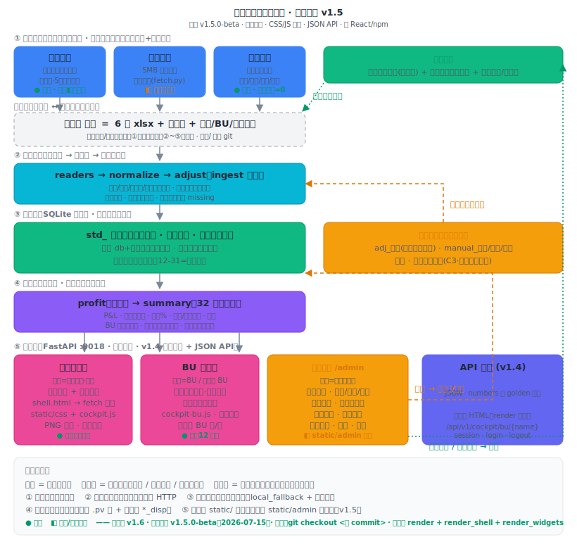

# 经营驾驶舱（利润看板）

> 一套**轻量自建 BI**：每天自动从业务系统抓数 + 读财务台账，算到**税前利润**，出一份科技风暗色（可切浅色）、手机可看的自包含 HTML 驾驶舱；管理员可在网页上改数、手填、看历史。零重型 BI 依赖——Python + SQLite + FastAPI + 手写 SVG 图，一台 Windows 内网机就能跑。
>
> 当前版本 **v8.2.1**（2026-07-11）· 测试 **227** 全绿 · 回归红线 32 周期一分不差

---

## 目录

- [这是什么](#这是什么)
- [系统架构](#系统架构)
- [6 个数据源](#6-个数据源)
- [计算业务逻辑](#计算业务逻辑)
- [页面功能导览](#页面功能导览)
- [快速开始](#快速开始)
- [代码地图](#代码地图)
- [质量保障与铁律](#质量保障与铁律)
- [版本与发布安全](#版本与发布安全)
- [设计图集与文档地图](#设计图集与文档地图)

---

## 这是什么

给管理层看的**经营利润驾驶舱**。业务背景：语言服务公司，管理层要一个"脱离 Excel、每天自动更新、手机能看"的实时利润视图——收入、成本、五类期间费用、税前利润，能按任意周期切、能下钻到费用明细细类、能看下单/回款排名。

**双端设计**（同一端口）：

| 端 | 地址 | 给谁 | 能干什么 |
|---|---|---|---|
| 用户端 | `/` | 权限=「整体」的账号（只读） | 账号+密码登录后看全部板块、顶部可点进各 BU 页、切周期、导出整页图片；右上可自改密码 |
| BU 用户端 | `/`（同一入口·权限=某 BU 名） | 各 BU 负责人（一 BU 可多账号） | 登录后首页直接是本 BU 页（完整利润表+下单/回款排名，按销售名单过滤、跨 BU 不泄漏）；整体/管理员可看任意 /bu/{BU名}；可自改密码 |
| 用户端·按时间段看 | `/`（板块③常显日期条） | 已登录整体页的人 | 日期条默认展开并跟顶部周期；可改任意起止日查询，三张排名卡就地按该段统计+一行合计；「返回默认（年）」回全年；排名卡「其余 N 个」点开全量弹窗（/api/daily，须整体/管理员会话） |
| 管理员端 | `/admin` | 权限=「管理员」的账号（默认 lushasha） | 改明细数（留痕可撤销）、手填月度数据、维护年度预算、异常处理、系统设置（含账号与权限明文管理） |

核心设计取舍：**前端零金额运算**——所有周期（年/季/月/任意月区间，30+ 个）的所有板块在 Python 侧预渲染成 HTML 块，前端只做显示切换。这保证了口径唯一、可测试、可回归对账。

## 系统架构



五层单向数据流，**抓数层与清洗层分开**：

```
① 抓数层   智云(明道云)4源自动登录在线抓 + 收单台账SMB抓 + 管理员表单手填
   └▶〔进料口〕数据/ 目录（6源文件+手填库）——上下游唯一接缝
② 清洗层   ingest：读原始→规范化(行哈希定位键)→重放人工调整(过期校验)
③ 存储层   SQLite 单文件：std_标准表 + adj_调整/manual_手填/meta_日志 人工表
④ 计算层   profit：只读库算 summary（32周期矩阵，纯函数）
⑤ 展示层   render：预渲染整体页、管理员端与 BU 独立页；server：FastAPI 提供页面与 /api/*
```

三条架构契约：

1. **进料口是唯一接缝**：换数据源/换抓取方式只动①和 readers，②以下不动。
2. **数据库是后端私有资产**：浏览器只经 HTTP 跟 FastAPI 要数据，从不直接碰库。
3. **抓数失败永不中断**：登录失败/token 失效/行数异常一律三态降级（沿用本地副本+体检黄），管道照跑。

新同学建议先看大白话版：[小白版运行逻辑图](docs/设计图/附_小白版运行逻辑图.svg)。

## 6 个数据源

| 源 | 供什么 | 类型 | 获取方式 |
|---|---|---|---|
| 项目明细（智云） | 收入（交付额÷1.06）+ 系统直接成本 | 系统 | 自动登录在线抓（只抓当年） |
| 任务·内部译员（智云） | 内部译员成本（从成本中减出） | 系统 | 自动抓 + 行数门槛护栏 |
| 下单（智云） | 下单额 + 部门/销售排名 | 系统 | 自动抓 |
| 回款记录（智云） | 到账额 + 客户排名 | 系统 | 自动抓 |
| 收单台账（Excel） | 市场/管理/固定运营/技术服务/财务五类费用 | 台账 | SMB 共享盘抓（不可达走本地副本） |
| 手填与调整表 | 各类人力成本、生产成本手填项、财务费用补充、其他损益 | 手填 | 管理员端表单（没填默认沿用上月） |

⚠ 仓库**不含任何数据**：`数据/` 目录整个被 .gitignore 挡住（库/凭据/xlsx/备份全部不进 git），真实数据只存在部署机本地。

## 计算业务逻辑

管理利润表口径（财务经理定稿，`config.json` 是税率与费用分类的唯一配置源）：

```
收入(不含税)  = 交付额 ÷ 1.06                          ← 智云项目明细
生产成本      = 系统直接成本 − 系统内部译员成本
              + 手填(PM人力/VM人力/实际内部译员/税费损失/技术流量/其他)
毛利          = 收入 − 生产成本
营销费用      = 营销人力成本(手填) + 市场费用(台账)
管理费用      = 管理人力成本(手填) + 管理费用(台账)
固定运营费用  = 台账
研发费用      = 研发人力成本(手填) + 技术服务费(台账)
财务费用      = 财务费用(台账) + 财务费用补充(手填)     ← 银行自动扣款台账显示不全
附加税费      = 增值税额 × 12%（增值税 = 不含税收入 × 6%）
税前利润      = 毛利 − 五类费用 − 附加税费 + 其他损益(手填,默认0)
```

几个关键机制：

- **周期矩阵**：全年 / Q1~Q4 / 各月 / **任意连续月区间**（日历面板点两个月），全部周期独立算好预渲染；区间数字=成员月加和（回归红线锁死自洽）。
- **手填 default=prev**：某月没填的手填项自动沿用上月（页面标注来源），年/季=期间内各月之和。
- **人工调整可重放**：管理员对任何明细行的改值/剔除记成"调整指令"（不改原始数据），每次重抓后自动重放；源头数据变了→"过期疑似"标黄留人工复核，定位键失配→计数提醒，**不会静默失效**。
- **费用归集**：收单台账按"对应报表大类"白名单路由进五类费用，未分类不计入（页面有小字兜底提示）；另有按预算归属部门/利润中心两个视角，分组合计==白名单合计（守恒测试锁死）。
- **数据体检**：每轮更新判绿/黄/红（黄=走本地副本/有过期调整/抓数降级），页面徽章+管理端原因区说明。

数据表结构见 [数据库 ER 图](docs/设计图/03_详细设计_数据库ER图.svg)，每日更新与人工改数的完整时序见 [关键流程时序图](docs/设计图/03_详细设计_关键流程时序图.svg)。

## 页面功能导览

**用户端（/）三段骨架**：

1. **基本情况**：5 张 KPI 卡（收入/毛利/税前利润/下单/回款）+ 迷你趋势线 + 环比。
2. **经营利润**：收入成本毛利率月度组合图 → 管理利润表（点大类→右侧抽屉看构成，两级下钻到费用明细细类）→ 期间费用构成（按大类环形图｜按部门｜按利润中心三态切换，每条可点开细类）→ 部门费用预算执行卡 → 回款按月+回款下单率+年预算完成率。
3. **下单与回款排名**：下单按部门/按销售、回款按客户（期内前 10 + 其余合计）。

全局能力：顶部日历式周期选择器（全年/季度快捷段+12 月网格自选区间）、暗/浅主题切换、每个数字标来源（智云/台账/手填）、右上数据体检徽章、**⬇ 导出=当前周期整页 2x PNG**（服务端 Playwright 截图，约 2 秒）。

**管理员端（/admin）**：数据总览 / 明细台账 / 手填与调整 / 年度预算 / 异常处理（总览、调整台账、下单未填部门、费用未分类、历史快照、**操作记录**）/ **设置**（各卡就近保存：自动更新、备份清理、智云账号、**账号与权限**明文表、**销售归属**、数据从哪来）。

**账号与 BU 分页（v8.0）**：登录账号在 `数据/看板账号.json`（权限=管理员/整体/某 BU 名；明文密码仅管理员可见；看的人可自改）。BU 数据归属在 `数据/BU配置.json`（BU 名+负责人备注+**销售名单=子页数字口径**，无密码）。整体账号看全部并可点进各 BU 页；BU 账号只看本 BU。两文件均不进 git；样例见 `docs/看板账号样例.json`、`docs/BU配置样例.json`。

**销售归属自助 + 未归属提示 + 配置留痕（v8.1·迭代16）**：设置页「销售归属」卡列出四源全部销售（带**当年下单笔数+金额参考**），**勾选多人→选 BU→批量指定**或直接拖拽，保存即重算——陆总自己勾映射即生效，新销售入职也能自配。未配 BU 的销售单子不进任何 BU 页，故整体页 BU 入口条下显示「另有未归属 BU 的业务 ¥X（N 名销售待配置归属）」（X 随周期变、解释「各 BU 合计<全公司」的差额），管理端顶栏体检也随之判黄。所有管理端配置改动（销售归属/BU/账号/设置/密码）都写入 `manual_配置变更` 留痕，管理端「异常处理→操作记录」倒序可回看（**不含密码明文**）。
## 快速开始

```bash
git clone https://github.com/EvanLee2004/BI.git && cd BI
python -m venv .venv && .venv/bin/pip install -r requirements.txt
.venv/bin/playwright install chromium        # 图片导出与智云自动登录用

# 把 6 个数据文件放进 数据/（文件名对照见 数据/README.md；仓库不带数据）
python run.py             # 更新一次：抓数→建库→算→出 output/经营驾驶舱.html
python run.py --serve     # 起内网双端服务（端口见 config，KANBAN_PORT 可覆盖）
python run.py --scheduled # 给 Windows 计划任务调用（每日自动更新）

KANBAN_OFFLINE=1 sh tests/run_verify.sh   # 一键验证：语法+端到端+回归红线+196测试（离线，不碰网络）
```

- 账号口令在 `数据/看板账号.json`（明文、不进 git；缺文件自动 seed）。管理员默认账号 `lushasha` / 口令 `kanban2026`；查看账号初始 `8888`——上线前改掉。
- **账号制（v8.0）**：一个入口 `/`，账号+密码按权限分流（管理员→`/admin`、整体→整体页、BU→本 BU；一 BU 可多账号）。看的人可自改密码；管理员端「设置→账号与权限」明文可见可改。
- 智云账号密码在管理员端·设置页填，保存即用（GUID 自动获取）。
- 完整装机步骤（venv/计划任务/开机自启/部署机复验清单）见 [docs/Windows部署手册.md](docs/Windows部署手册.md)。
- 测试/正式数据切换只改 `config.json` 的 `data_dir`，代码零改动。

## 代码地图

```
run.py                入口（更新 / --serve / --scheduled）
config.json           业务口径唯一配置源（税率/费用大类/手填项/周期/路径）
src/
  schema.py           全表 DDL + 字段常量唯一源（可调整字段黑名单从这推导）
  db.py               连接 + 读回层 + 明细查询 + 写函数（调整/手填/预算）
  ingest/             更新管道：readers读原始 → normalize规范化(行哈希定位键)
                      → fetch台账SMB / login_zhiyun+fetch_zhiyun智云自动抓
                      → adjust调整重放 → archive备份快照 → __init__串管道
  profit.py           ★ 全 P&L 计算（只读库，纯函数，32 周期矩阵+排名）
  bu.py               BU 配置读写、校验与口令哈希（BU 名即账号；真实配置仅在 数据/）
  periods.py          年/季/月/月区间周期生成
  charts.py           手写 SVG 图（颜色走 CSS 变量，主题自动跟随）
  theme.py            暗色/浅色两套 CSS 变量
  render.py           双端 HTML 组装 + 前端 JS（只切显示，零金额运算）
  server.py           FastAPI 双端 + /api/* + 管理员控制台
  loaders/columns/validate  配置/按表头找列/进门体检
tests/                196 用例（13 套）+ 回归红线 + run_verify.sh 一键验证
docs/                 部署手册 / 数据来源说明 / 设计图
```

## 质量保障与铁律

- **回归红线**：`tests/regress_db_vs_files.py`——从库算与从文件直算，32 个周期全部数字逐字段一分不差；任何动计算/清洗的改动跑它兜底。
- **守恒红线**：费用分组视角合计==台账白名单合计；区间==成员月之和；没填预算时页面与旧版一字不差。
- **前端不算数守卫**：测试扫描产物 HTML，出现 `toFixed/parseFloat` 即失败。
- 开发铁律 13 条（智云 xlsx 绝不 read_only / 列按表头找 / 必需列缺失即报错 / 同名控件合并去重空不覆盖有值 / 自由文本进 HTML 必转义……）全文见 [CLAUDE.md](CLAUDE.md)。
- 每个改动批次：补测试 → `run_verify.sh` 全绿 → 同步 CHANGELOG/测试说明 → commit+push。

## 版本与发布安全

- 版本节点：… → v7.9 看板账号制 → v8.0 账号与 BU 解耦 + 管理端优化 → **v8.1 销售归属自助 + 未归属提示 + 配置变更留痕**（完整 CHANGELOG 在项目本地文档库）。
- **`main` 是唯一开发与发布分支**；`archive-*` 分支为含历史数据的本机档案，永不推送、绝不 `push --tags`。
- push 前安检：`git log origin/main..main --name-only` 逐 commit 核清单——无 xlsx/csv/db、无真实金额/客户名/内网 IP/账号，有就停。

## 设计图集与文档地图

| 图 | 说明 |
|---|---|
| [系统架构图](docs/设计图/02_概要设计_系统架构图.svg) | 五层单向 + 双端 + 进料口契约 |
| [关键流程时序图](docs/设计图/03_详细设计_关键流程时序图.svg) | 每日更新 / 管理员改数 / 秒级重算 |
| [数据库 ER 图](docs/设计图/03_详细设计_数据库ER图.svg) | std_ 标准表 + 人工表 + 关系 |
| [小白版运行逻辑图](docs/设计图/附_小白版运行逻辑图.svg) | 大白话版：系统每天怎么跑、怎么用 |

更深的文档（需求台账、概要/详细设计全文、测试说明、迭代计划）在项目本地文档库 `方案与文档/软件工程文档/`（含业务数据口径，不随代码公开）。
