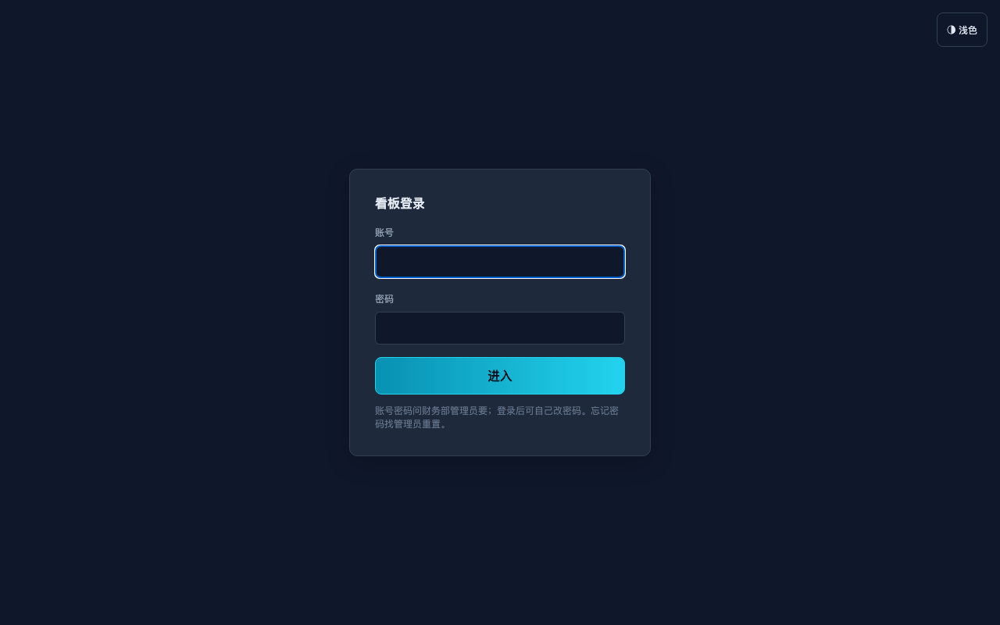
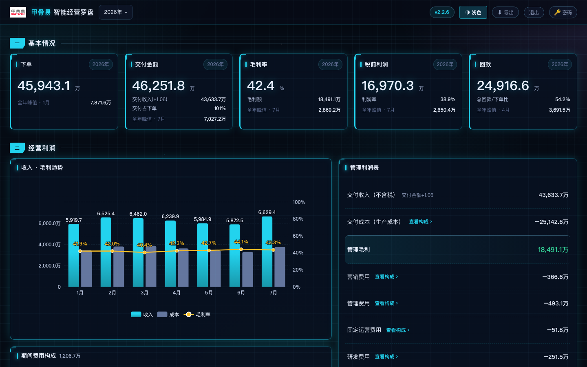
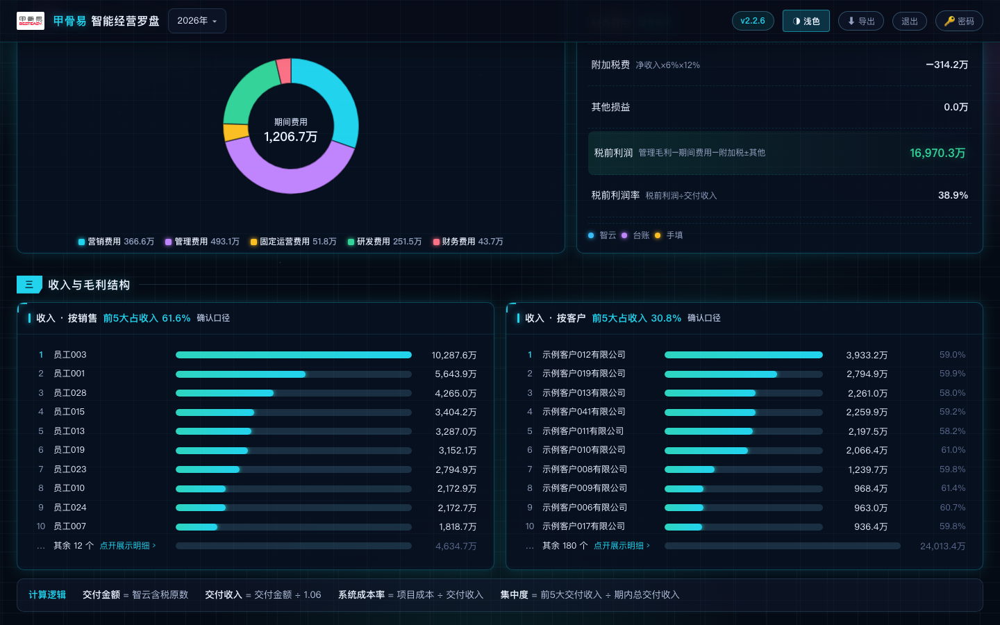
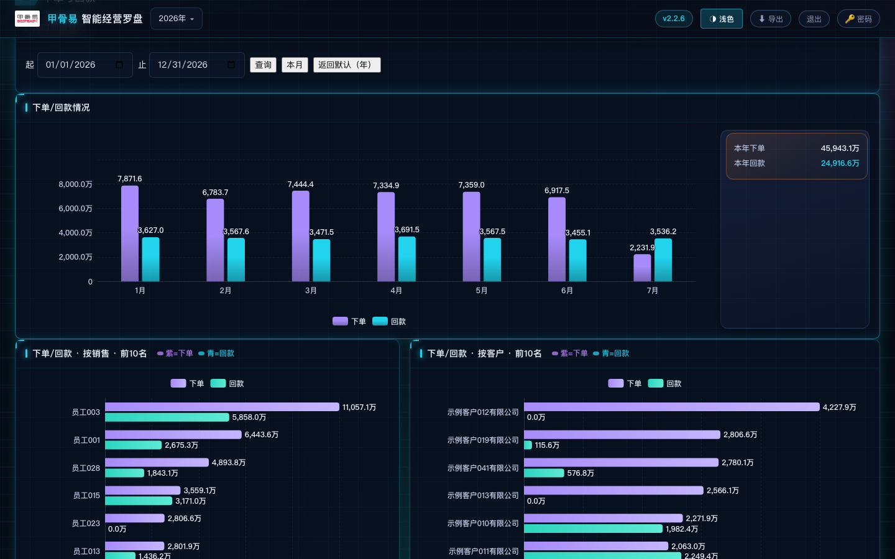
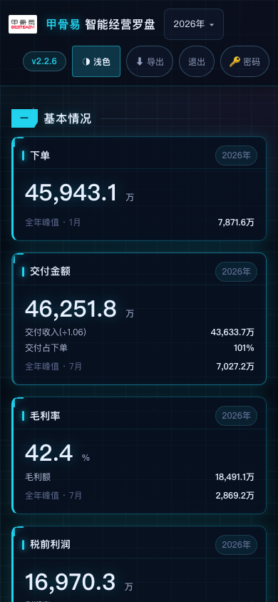
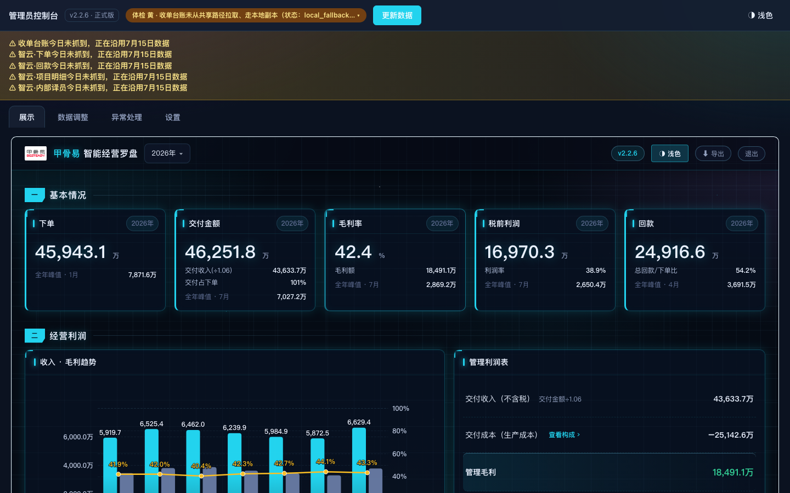
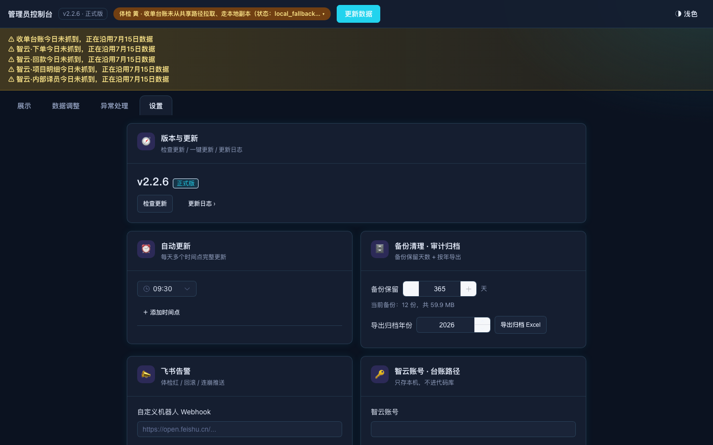
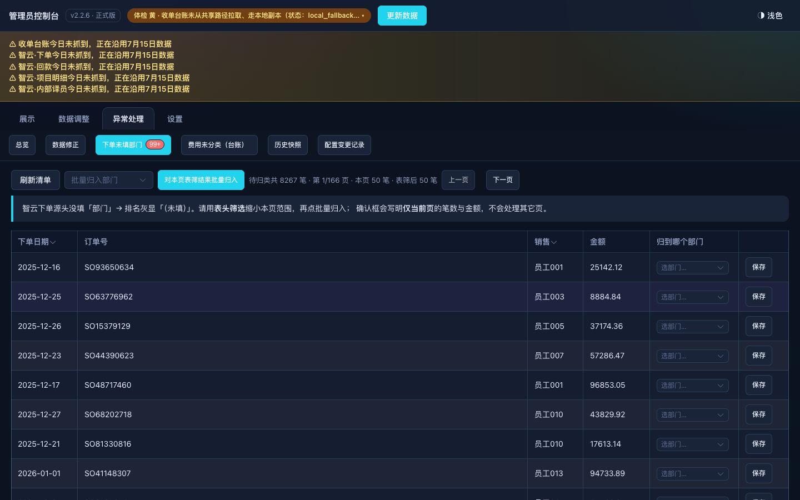
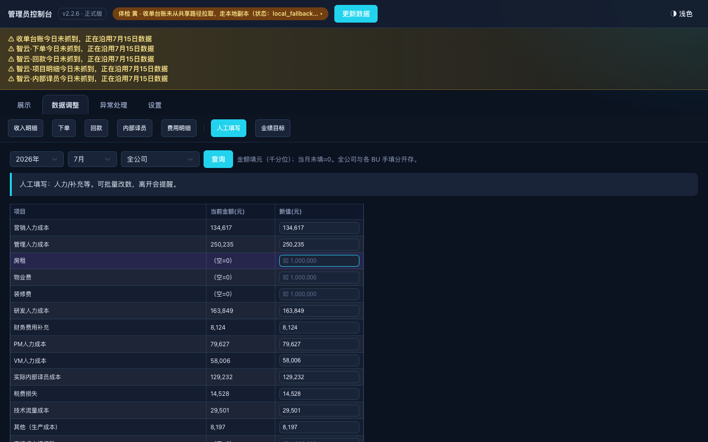
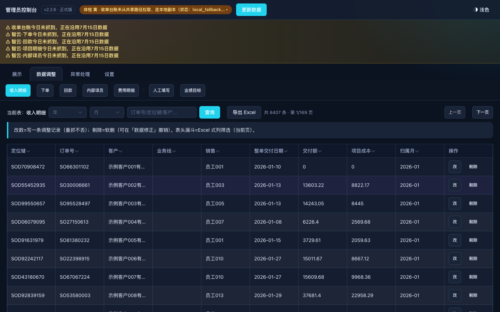

# 甲骨易智能经营罗盘

**给财务与管理层用的经营利润驾驶舱** —— 每天自动汇总业务数据，算出税前利润，公司内网电脑和手机都能看。

| 当前版本 | 技术栈 | 生产形态 |
|:---:|:---|:---|
| **v2.2.6**（以根目录 [`VERSION`](./VERSION) 为准） | Python · SQLite · FastAPI · Vue 3 · ECharts | 公司 Ubuntu · nginx · systemd · 定时刷新 |

> 版本历史见 [`CHANGELOG.md`](./CHANGELOG.md)。业务数据与账号密码**不进本仓库**。

---

## 一分钟看懂它是做什么的

语言服务公司日常要盯：**下了多少单、交付了多少、毛利怎样、费用花在哪、回款到账了没有、税前还剩多少**。

以前这些数散在智云系统、收单台账 Excel、手填表里，对一遍很慢。  
这个系统把它们接到一起，按统一规则算完，做成一页驾驶舱：

- **管理层**看全公司，也能进各业务线（BU）
- **业务线负责人**只看自己线的数，看不到别人的
- **财务管理员**在后台改明细、填人力/分摊、对异常、一键更新程序

金额全部在服务端算好；浏览器只负责展示和切换年/季/月。  
页面上的数字是**管理确认口径**（比完整财务记账更前置），方便日常经营讨论，不是替代总账/报税。

---

## 界面长什么样

下面截图来自本仓库 **演示数据** 离线跑通后的真实页面（非生产客户数据）。

### 登录



同一套入口：输入账号后，系统按权限进入「整体 / 某业务线 / 管理端」。

### 看端 · 基本情况与经营利润（暗色）



顶栏可选年份与主题；五张 KPI 卡一眼看到下单、交付、毛利率、税前利润、回款。



左：收入 / 成本 / 毛利率趋势；右：管理利润表（可点「查看构成」下钻）。

### 看端 · 结构与排名



收入与毛利按客户、按销售拆开；下方还有费用明细、下单与回款等板块（页面可继续下滚）。

### 手机



内网手机竖屏可扫一眼 KPI；复杂操作建议用电脑。

### 管理端 · 控制台与设置



管理员可嵌看驾驶舱、点「更新数据」、看体检黄条（例如台账今日未从共享盘抓到、沿用本地副本）。



账号、智云连接、备份与版本更新等集中在设置页。

### 管理端 · 日常维护

| 场景 | 截图 |
|------|------|
| 下单未填部门 · 归类 |  |
| 人工填写 · 人力/分摊/去税 |  |
| 数据调整 · 明细改数 |  |

更细的操作步骤见 [用户手册](docs/用户手册/)。

---

## 谁用、能做什么

| 角色 | 怎么进 | 能做什么 |
|------|--------|----------|
| 管理层（整体） | 登录 · 权限「整体」 | 全公司 KPI、利润表、结构、排名；进入各 BU；导出整页 PNG |
| 业务线负责人 | 登录 · 权限绑定某 BU | 只看本 BU（按销售名单过滤，跨线不可见） |
| 财务管理员 | `/admin` | 改明细、手填与分摊、预算、异常处理、销售归属、账号、检查更新 / 一键更新 |

---

## 数从哪来

| 数据源 | 主要提供什么 | 怎么进系统 |
|--------|--------------|------------|
| 项目明细（智云） | 交付收入、系统直接成本 | 自动登录抓取 |
| 内部译员（智云） | 从成本中减出的内部人力 | 自动抓取（有行数护栏） |
| 下单（智云） | 下单额、部门 / 销售排名 | 自动抓取 |
| 回款记录（智云） | 到账额、客户相关排名 | 自动抓取 |
| 收单台账（Excel） | 营销 / 管理 / 固定运营 / 研发 / 财务等期间费用 | 共享盘；不可达时用本机副本并黄条提示 |
| 手填与调整 | 人力等成本补充、公共费用分摊比例、去税率等 | 管理端表单；**当月没填按 0** |

仓库里**没有**真实经营表；部署时把文件放进 `数据/`（说明见 [数据/README.md](数据/README.md)）。字段级说明见 [docs/数据来源说明.md](docs/数据来源说明.md)。

---

## 利润怎么算（摘要）

税率与费用分类以 `config.json` 为准。管理利润表主干可以记成：

```text
收入（不含税）  = 交付额 ÷ 1.06          （按整单交付日期归月）
生产成本        = 系统直接成本 − 内部译员 + 手填 − 直接成本增值税（默认 0）
毛利            = 收入 − 生产成本
期间费用（五类）= 手填人力 + 台账费用（营销 / 管理 / 固定运营 / 研发 / 财务）
附加税费        = 增值税 × 12%            （增值税 ≈ 不含税收入 × 6%，管理估算）
税前利润        = 毛利 − 期间费用 − 附加税费 + 其他损益
```

日常还需要知道：

- **改明细**写的是可重放的调整指令，不会改坏源头文件；重抓后会自动套上  
- **公共费用**可按月比例分到各 BU（合计可以不到 100%，剩下的留在公司层）  
- **费用去税**按类别手填税率；不填 = 不去税  
- 结构板块里的「项目直接毛利」未含内部译员 / 手填，所以分项加总可能与利润表总毛利略有差别——这是展示口径不同，不是算错  
- 每轮更新有数据体检（绿 / 黄 / 红），黄通常表示「还能用，但请留意」

对不上 Excel 时，先对齐时间段和是否同一口径，再查手填是否保存。常见问答：[docs/用户手册/FAQ.md](docs/用户手册/FAQ.md)。

---

## 快速开始（本机）

```bash
# GitHub
git clone https://github.com/EvanLee2004/BI.git && cd BI
# 国内镜像（Gitee）
# git clone https://gitee.com/Lee157/oracleeasy--bi.git && cd oracleeasy--bi

python -m venv .venv
.venv/bin/pip install -r requirements.txt
.venv/bin/playwright install chromium   # 导出 PNG、智云自动登录需要

# 将 6 个数据文件放入 数据/（仓库不带业务数据，见 数据/README.md）
python run.py             # 抓数 / 建库 / 算账 一次
python run.py --serve     # 起服务，默认 http://127.0.0.1:8018
```

| 项 | 说明 |
|----|------|
| 端口 | 环境变量 `KANBAN_PORT` 可改 |
| 离线预览 | `KANBAN_OFFLINE=1 python run.py --serve`（不依赖外网抓数时） |
| 默认账号（仅初次种子） | 管理员 `lushasha` / `kanban2026`；查看类账号初始密码见种子逻辑，**上线务必改掉** |
| 账号文件 | `数据/看板账号.json`（不进 git；缺失时会自动生成种子） |
| 智云账号 | 管理端 → 设置 中配置 |
| 全量自检 | `KANBAN_OFFLINE=1 sh tests/run_verify.sh` |

### 开发时前后端分开

| 模式 | 做法 |
|------|------|
| 后端 API | `python run.py --serve` |
| 前端热更新 | 另开终端：`cd frontend && npm run dev`（Vite 把 `/api` 代理到 8018） |
| 生产 | 只发构建好的 `frontend/dist`，由 nginx 托管，**不在生产装 Node** |

---

## 系统怎么串起来

生产链路可以记成：

**浏览器 / 手机 → nginx(:80) → Vue 静态页 + API → 算账引擎 → SQLite**  
数据进来：智云 / 共享盘台账 / 管理端手填 → 清洗与调整重放 → 入库 → 预计算好各周期数字 → 看端用接口取「已经算好的结果」。

### 1. 逻辑架构


### 2. 部署拓扑（公司机）


- 进程：`systemd` 服务 `kanban`（开机自启、异常可自愈）  
- 入口：`http://<内网IP>/`（nginx 发 `frontend/dist` 并反代 API）  
- 应用进程只监听本机，不把 API 端口直接暴露到办公网  
- 定时：进程内日更 + cron 体检 / 备份  

装机步骤：[docs/Ubuntu部署手册.md](docs/Ubuntu部署手册.md) · 排障：[docs/Runbook.md](docs/Runbook.md)

### 3. 模块关系


### 4. 登录与权限


### 5. 每天怎么跑（白话）


### 6. 关键时序与数据模型


库内存金额用「分」整数，避免浮点误差；账号与 BU 配置在 JSON 文件里，不在业务库表中。图注与文件清单见 [docs/images/FIGURES.md](docs/images/FIGURES.md)。矢量源在 [docs/设计图/](docs/设计图/)。

---

## 目录导读

```text
run.py                 更新管道 / 启动服务
config.json            税率、文件名、刷新时刻等出厂默认（机器差异写 数据/本地配置.json）
VERSION                当前产品版本号（管理端展示读这里）
CHANGELOG.md           变更记录
frontend/              Vue 源码与构建产物 dist/
src/                   抓数、库、算账、HTTP 路由、一键更新等
static/                登录页、主题、导出用 HTML 模板等
数据/                  本机业务数据与账号（gitignore，不进仓库）
tests/                 回归与契约测试
docs/                  使用手册、部署、API、设计图、界面截图
deploy/linux/          nginx / systemd 模板
```

一键更新（管理端「检查更新」）：对配置的 git 远端 `fetch`，落后时 `git pull --ff-only`，依赖变化会装包，再由看门狗重启服务。工作区被改脏会拒绝更新，以免覆盖人工改动。

---

## 文档地图

| 你想… | 去读 |
|--------|------|
| 给同事讲怎么点页面 | [docs/用户手册/](docs/用户手册/)（看板 · 管理端 · FAQ） |
| 弄清六源字段与进料 | [docs/数据来源说明.md](docs/数据来源说明.md) |
| 在 Ubuntu 上装 / 升级 | [docs/Ubuntu部署手册.md](docs/Ubuntu部署手册.md) |
| 线上坏了怎么查 | [docs/Runbook.md](docs/Runbook.md) |
| 看端 API / 渲染约定 | [docs/api-v1-cockpit.md](docs/api-v1-cockpit.md) · [docs/api/](docs/api/) |
| 接口与库表清单 | [docs/softeng/](docs/softeng/) |
| 为什么这样设计 | [docs/madr/](docs/madr/) |
| 系统教学向总览 | [docs/系统教学说明_甲骨易智能经营罗盘_v1.md](docs/系统教学说明_甲骨易智能经营罗盘_v1.md) |
| 文档总索引 | [docs/README.md](docs/README.md) |

---

## 质量与发布约定

- 核心数字有回归基准：库内计算结果与基准 JSON 对齐；多周期金额一致性有自动化检查  
- 前端展示串由后端给出，避免浏览器自行做金额运算导致口径漂移  
- 发布只走 `main`；推远端前会检查是否误带真实金额、客户名、账号等敏感内容  
- 公开仓库**不推送** git tag / GitHub Release（版本以 `VERSION` + `CHANGELOG` 为准）

---

## 许可证与数据安全

本仓库代码用于甲骨易内部经营看板。  
**请勿**把 `数据/` 下的真实 Excel、数据库、账号文件提交进 git 或发到公开渠道。演示截图仅使用本地 golden / 离线样例数据生成。
