# 甲骨易经营看板（智能经营罗盘）

给财务与管理层用的**经营利润驾驶舱**：把散落在智云、收单台账、手填表里的数据接到一起，按统一规则算到税前利润，在公司内网电脑和手机上一页看清。

| 项 | 说明 |
|:---|:---|
| **当前版本** | **v3.7.19**（以根目录 [`VERSION`](./VERSION) 为准） |
| **技术栈** | Python · SQLite · FastAPI · Vue 3 · ECharts |
| **生产形态** | 公司 Ubuntu · nginx · systemd · 候选预热发版 · 定时刷新 · CIFS 台账 |
| **变更史** | [`CHANGELOG.md`](./CHANGELOG.md) |

> **现状以何为准**：本仓 `VERSION` + 项目根 `progress.md` 顶部 + `git rev-parse HEAD`。下文不钉死历史小版本号。  
> **业务数据与账号密码不进本仓库。** 公开仓 LICENSE 待负责人选型（勿擅自添加）。

**运维速查** → [生产运维](#生产运维) · 故障处方 [docs/Runbook.md](docs/Runbook.md)

---

## 它解决什么问题

语言服务公司日常要盯：下了多少单、交付了多少、毛利怎样、费用花在哪、回款到账了没有、税前还剩多少。

以前这些数分散在多套系统与 Excel 里，对一遍很慢。本系统把它们接到一起，按统一规则算完，做成一页驾驶舱：

- **管理层**看全公司，也能下钻各业务线（BU）
- **业务线负责人**只看自己线的数，看不到别人的
- **财务管理员**在后台改明细、填人力/分摊、对异常、一键更新程序

金额全部在**服务端**算好；浏览器只负责展示和切换年/季/月。  
页面数字是**管理确认口径**（比完整财务记账更前置），方便日常经营讨论，**不是**替代总账或报税。

---

## 谁用、能做什么

| 角色 | 怎么进 | 能做什么 |
|------|--------|----------|
| 管理层（整体） | 登录 · 权限「整体」 | 全公司 KPI、利润表、结构、排名；进入各 BU；导出 HTML 快照 / 利润表 Excel |
| 业务线负责人 | 登录 · 权限「BU」+ 可见名单 | 只看绑定业务线（可多个，顶栏「我的 BU」切换；**无「← 整体」**）；本 BU 快照 / 利润表 Excel |
| 财务管理员 | `/admin` | 改明细、手填与分摊、预算、异常、用户统计、销售归属、账号、检查/一键更新 |

全员只发**两个根链接**即可（见 [访问入口](#1-访问入口只发这两个)），用各自账号登录；系统按权限自动进整体或业务线。

---

## 界面一览

截图来自仓库 **`_golden_data` 脱敏演示数据**（合成客户名「示例客户*」/「员工*」），**非生产客户数据**。本机可用 `KANBAN_PROFILE=dev KANBAN_OFFLINE=1` 复现。

### 登录

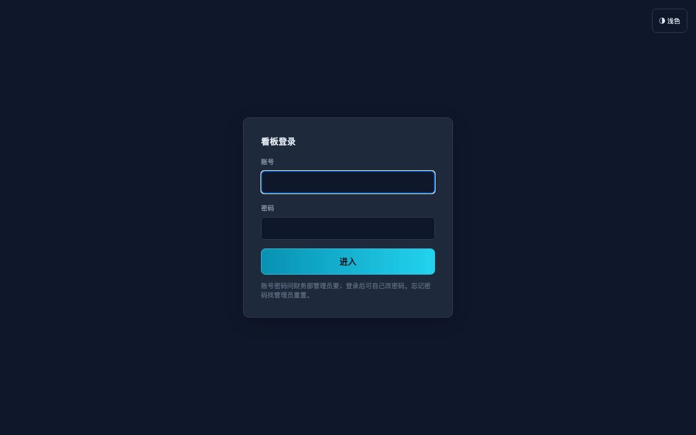

同一入口：输入账号后，系统按权限进入「整体 / 某业务线 / 管理端」。

### 三套主题

| 主题 | 定位 | 截图 |
|------|------|------|
| **霓虹**（默认） | 演示 / 投屏 | 见下「看端首页」 |
| **深空** | 日常办公 | 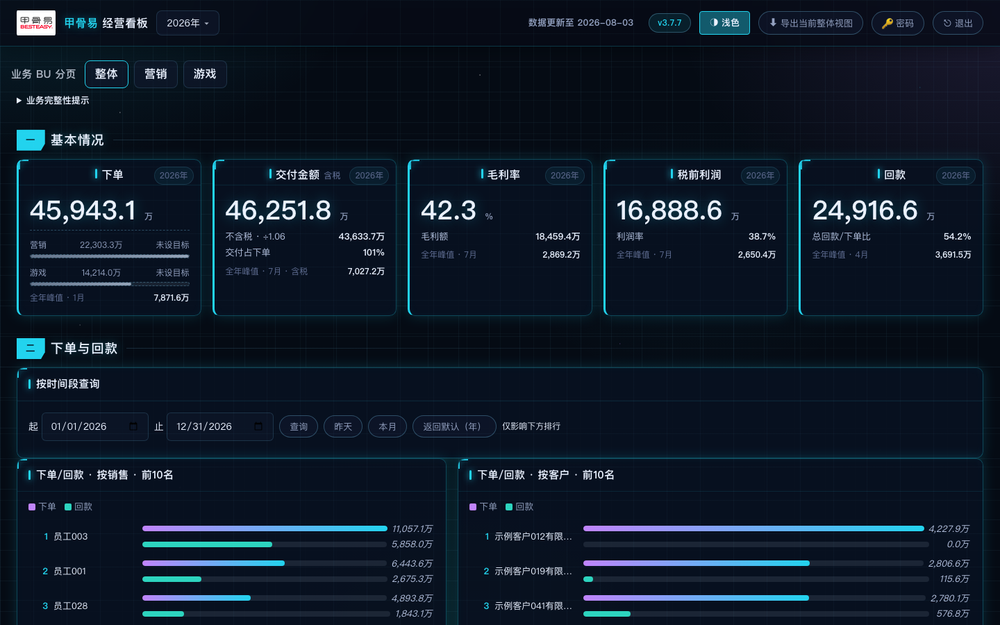 |
| **晨光** | 白天 / 打印 | 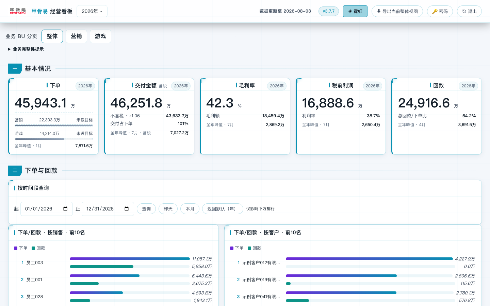 |

顶栏主题钮循环：**霓虹 → 深空 → 晨光 → 霓虹**。发布后 `theme.css` 带 `?v=` + 产品版本，便于缓存刷新。

### 看端 · 首屏六段

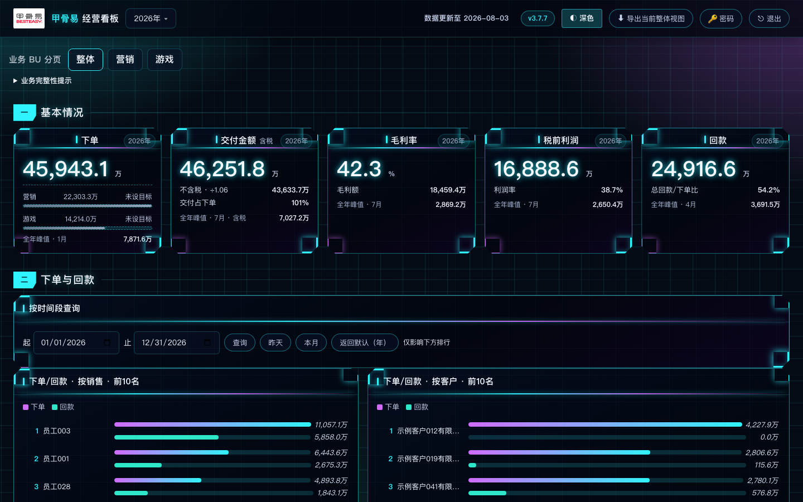

顶栏：年份/周期、**数据更新至**、版本角标、主题、导出、改密、退出。  
五张 KPI：下单、交付金额（「含税」+ 副行「不含税 · ÷1.06」）、毛利率、税前利润、回款。

| 序号 | 区块 | 要点 |
|------|------|------|
| 一 | **基本情况** | 五张 KPI |
| 二 | **下单与回款** | 日查（含「昨天」）→ 双榜 → 柱图 |
| 三 | **重点客户下单情况追踪** | 六档、双饼、三池、连续月折线（自然年） |
| 四 | **经营利润** | 趋势 + 管理利润表 |
| 五 | **收入与毛利结构** | 按客户 / 销售排名 |
| 六 | **费用明细** | 热力 + 台账表 |

整体与 BU 同序。

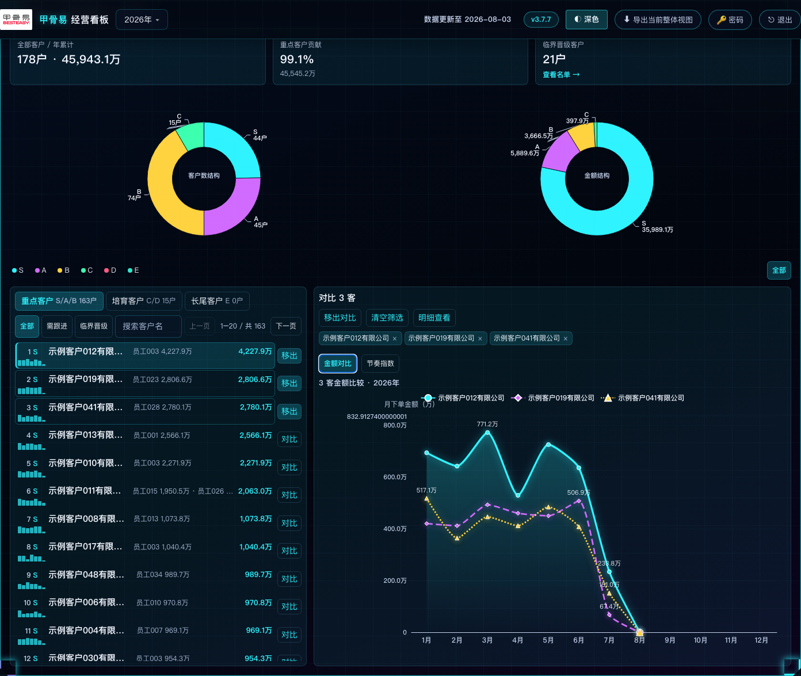

点名单「对比」后的作战台：左池 S/A/B 名单；右为 **对比 N 客** + **金额对比** 折线（1～12 月下单预估）。未点对比时右侧为需跟进 / 临界晋级行动队列。

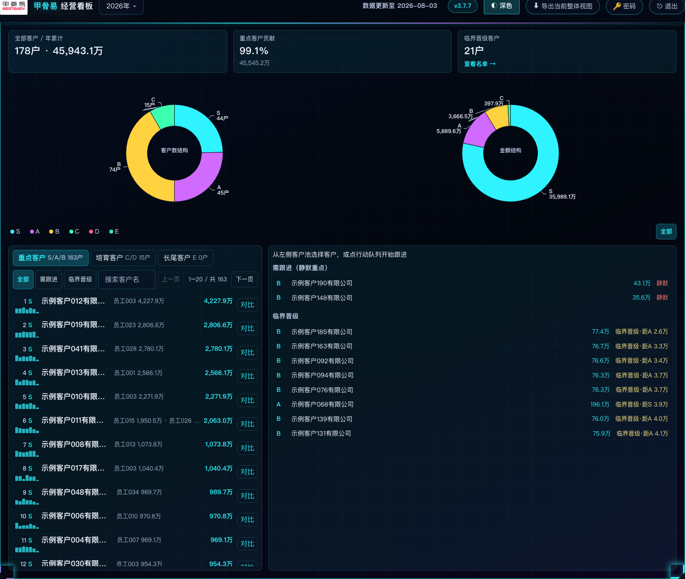

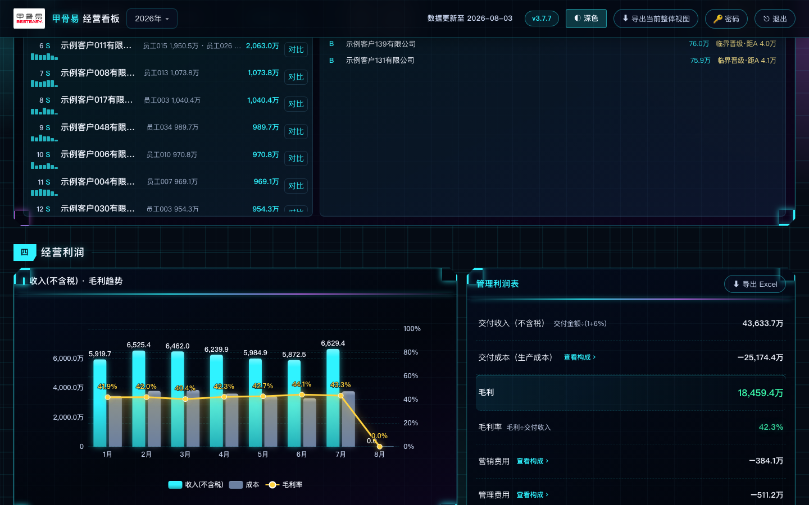

左：收入 / 成本 / 毛利率趋势；右：管理利润表（可「查看构成」；导出 Excel 时「其他 N 项」展开子项）。

### 看端 · 结构与费用

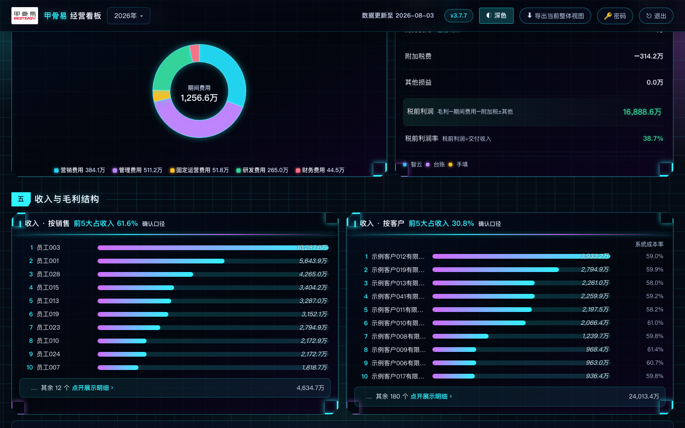

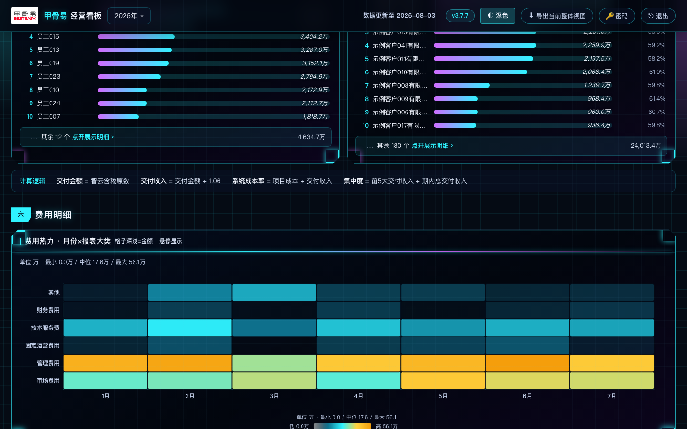

### 手机

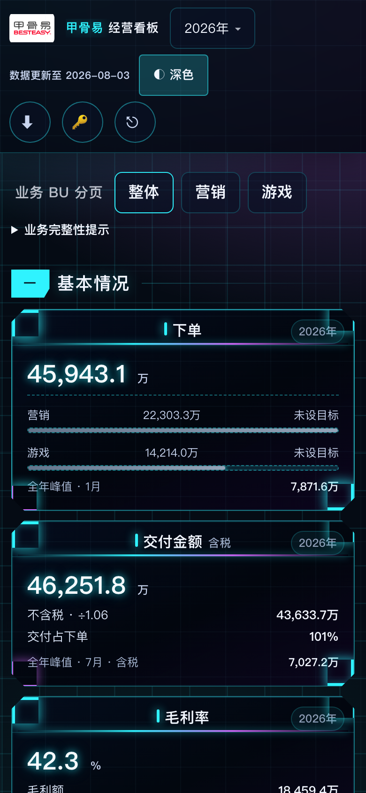

内网手机竖屏可扫 KPI；约 390 宽已适配。复杂操作建议电脑。

### 管理端

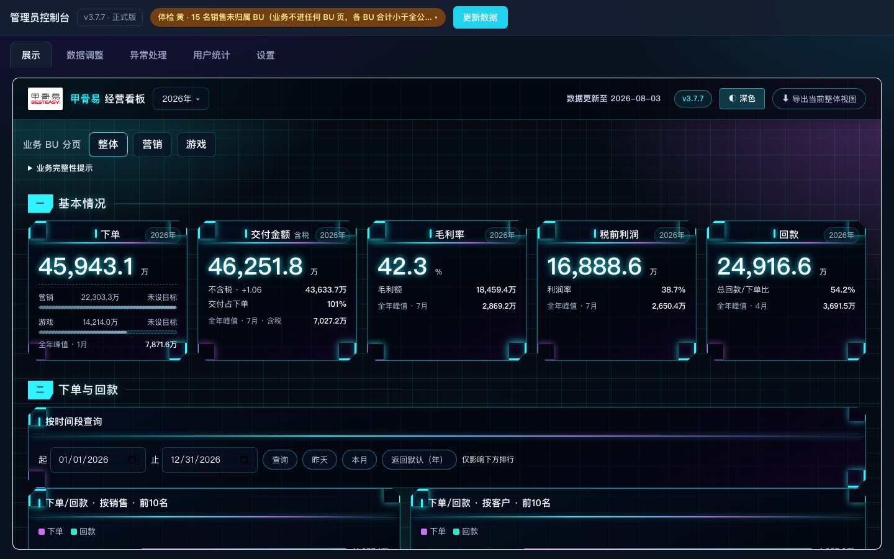

管理员进入 `/admin`：嵌看驾驶舱、「更新数据」、体检灯：

| 灯色 | 含义 |
|------|------|
| 绿 | 该抓的源都抓到，无业务提醒 |
| 黄 | 抓齐，仍有业务提醒（如手填缺月） |
| 红 | 有源本次未抓到，或硬故障 |

未到点的定时槽只算「待执行」，不误报漏跑。


账号、智云连接、台账共享（CIFS）、备份与版本更新等集中在设置页。  
**智云密码 / 账号密码接口永不回显明文**；留空 = 不改已存值；重置须手输新密码。

| 场景 | 截图 |
|------|------|
| 异常总览 | 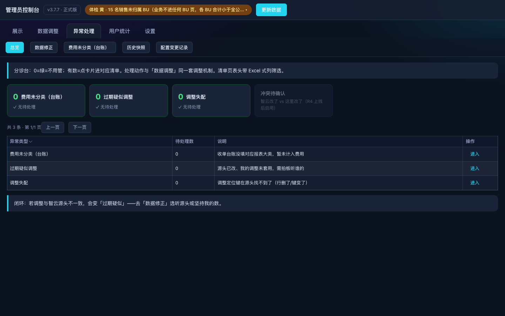 |
| 人工填写 · 人力/分摊/去税 | 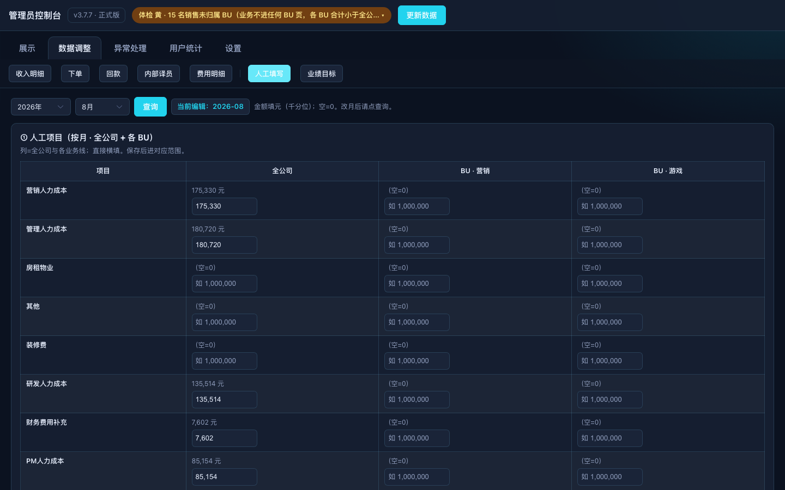 |
| 数据调整 · 明细改数 | 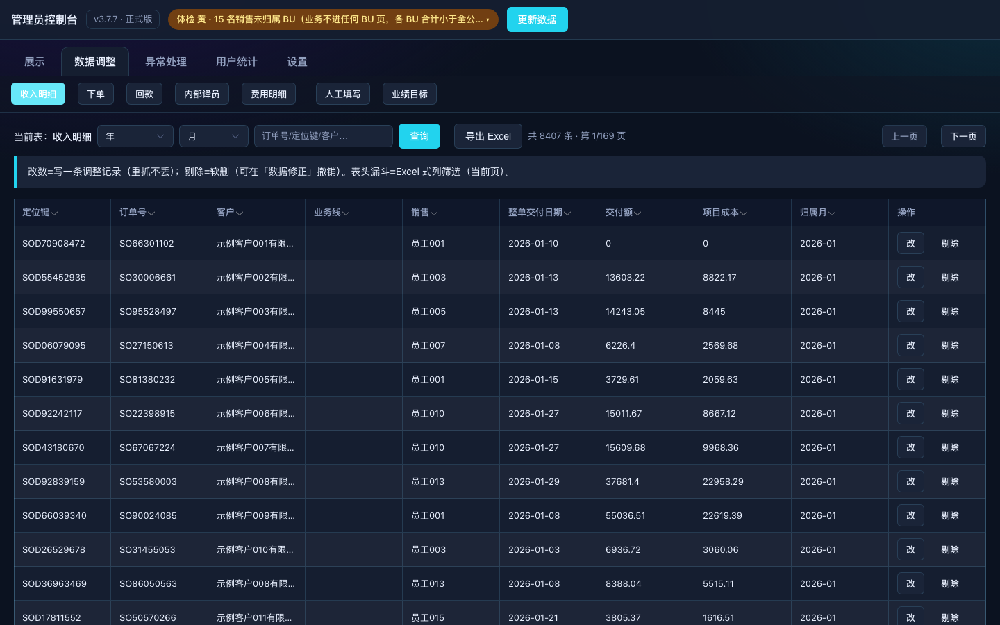 |

更细操作步骤见 [用户手册](docs/用户手册/)。

---

## 数从哪来

| 数据源 | 主要提供什么 | 怎么进系统 |
|--------|--------------|------------|
| 项目明细（智云） | 交付收入、系统直接成本 | 自动登录抓取 |
| 内部译员（智云） | 从成本中减出的内部人力 | 自动抓取（有行数护栏） |
| 下单（智云） | 下单额、部门 / 销售排名 | 自动抓取 |
| 回款记录（智云） | 到账额、客户相关排名 | 自动抓取 |
| 收单台账（Excel） | 营销 / 管理 / 固定运营 / 研发 / 财务等期间费用 | 共享盘 CIFS；不可达时用本机副本并标红 |
| 手填与调整 | 人力补充、公共费用分摊、去税率等 | 管理端表单；**当月没填按 0** |

仓库**不含**真实经营表；部署时把文件放进 `数据/`（见 [数据/README.md](数据/README.md)）。字段级说明：[docs/数据来源说明.md](docs/数据来源说明.md)。

---

## 利润怎么算（摘要）

税率与费用分类以 `config.json` 为准。管理利润表主干：

```text
收入（不含税）  = 交付额 ÷ 1.06          （按整单交付日期归月）
生产成本        = 系统直接成本 − 内部译员 + 手填 − 直接成本增值税（默认 0）
毛利            = 收入 − 生产成本
期间费用（五类）= 手填人力 + 台账费用（营销 / 管理 / 固定运营 / 研发 / 财务）
附加税费        = 增值税 × 12%            （增值税 ≈ 不含税收入 × 6%，管理估算）
税前利润        = 毛利 − 期间费用 − 附加税费 + 其他损益
```

日常还需知道：

- **改明细**写的是可重放的调整指令，不会改坏源头文件；重抓后会自动套上
- **公共费用**可按月比例分到各 BU（合计可以不到 100%，剩下的留在公司层）
- **费用去税**按类别手填税率；不填 = 不去税
- 结构板块里的「项目直接毛利」未含内部译员 / 手填，分项加总可能与利润表总毛利略有差别——是展示口径不同，不是算错
- **口径一句话**：当期生产交付即确认收入（按整单交付日期归月），方便经营讨论，不是总账/报税口径

对不上 Excel 时，先对齐时间段和是否同一口径，再查手填是否保存。常见问答：[docs/用户手册/FAQ.md](docs/用户手册/FAQ.md)。

---

## 快速开始（本机）

```bash
# GitHub
git clone https://github.com/EvanLee2004/BI.git && cd BI
# 国内镜像（Gitee）
# git clone https://gitee.com/Lee157/oracleeasy--bi.git && cd oracleeasy--bi

python -m venv .venv
.venv/bin/pip install -r requirements.txt
.venv/bin/playwright install chromium   # 智云自动登录；兼容 /export.png 截图

# 将 6 个数据文件放入 数据/（仓库不带业务数据，见 数据/README.md）
python run.py             # 抓数 / 建库 / 算账 一次
python run.py --serve     # 起服务，默认 http://127.0.0.1:8018
```

| 项 | 说明 |
|----|------|
| 端口 | 环境变量 `KANBAN_PORT` 可改 |
| 离线预览 | `KANBAN_OFFLINE=1 python run.py --serve` |
| 默认账号（仅初次种子） | 管理员 `lushasha` / `kanban2026`；**上线务必改掉** |
| 账号文件 | `数据/看板账号.json`（不进 git；缺失时自动生成种子） |
| 智云账号 | 管理端 → 设置 中配置 |
| 全量自检 | **必须用项目 `.venv`** + `KANBAN_OFFLINE=1 sh tests/run_verify.sh`（判绿看真实退出码，勿 `\| tail`） |
| 本地冒烟 | `KANBAN_OFFLINE=1 sh scripts/smoke_cockpit_local.sh` |

### 开发时前后端分开

| 模式 | 做法 |
|------|------|
| 后端 API | `python run.py --serve` |
| 前端热更新 | 另开终端：`cd frontend && npm run dev`（Vite 把 `/api` 代理到 8018） |
| 生产 | 只发构建好的 `frontend/dist`，由 nginx 托管，**不在生产装 Node** |

---

## 系统怎么串起来

```text
浏览器 / 手机 → nginx(:80) → Vue 静态页 + API → 算账引擎 → SQLite
数据进来：智云 / 共享盘台账 / 管理端手填 → 清洗与调整重放 → 入库 → 预计算 → 看端取「已算好的结果」
```

### 数据流（Mermaid）

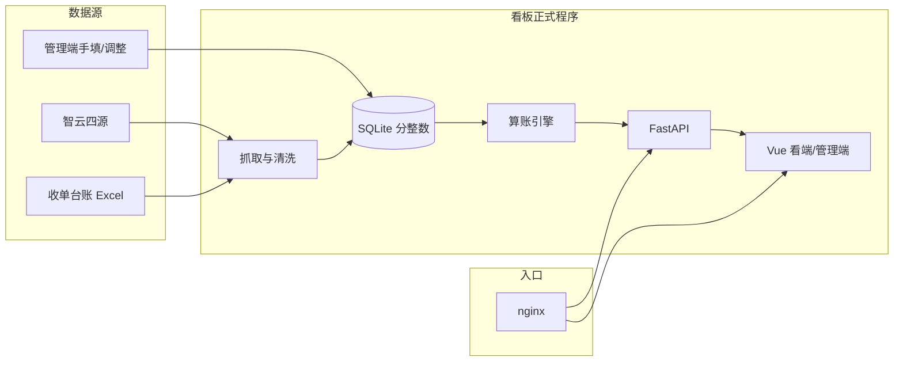
```mermaid
flowchart LR
  subgraph sources [数据源]
    ZY[智云四源]
    LD[收单台账 Excel]
    MF[管理端手填/调整]
  end
  subgraph app [看板正式程序]
    IN[抓取与清洗]
    DB[(SQLite 分整数)]
    ENG[算账引擎]
    API[FastAPI]
    VU[Vue 看端/管理端]
  end
  subgraph edge [入口]
    NGX[nginx]
  end
  ZY --> IN
  LD --> IN
  MF --> DB
  IN --> DB
  DB --> ENG
  ENG --> API
  API --> VU
  NGX --> VU
  NGX --> API
```

- **BU 利润表**：每个业务线一张「缩小版公司表」——只汇总该线销售名下的收入/成本/费用（经销售→BU 映射）
- **金额只在服务端算**；浏览器只展示 `value_disp` 等展示串
- **会话**：仅 cookie `kanban_sid`；API 均在 `/api/v1/*`
- **导出**：看端 HTML 快照走 `kanban_snapshot`；利润表可导出 Excel

### 架构与部署图

| 图 | 说明 |
|----|------|
| 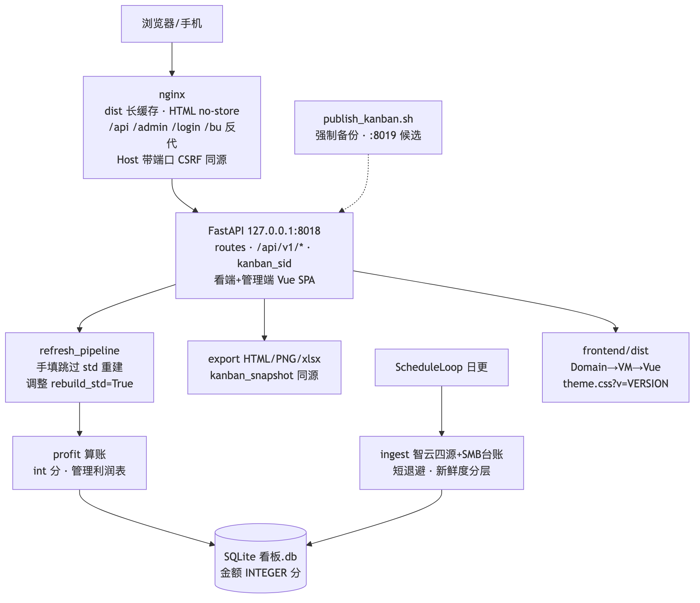 | 逻辑架构 |
| 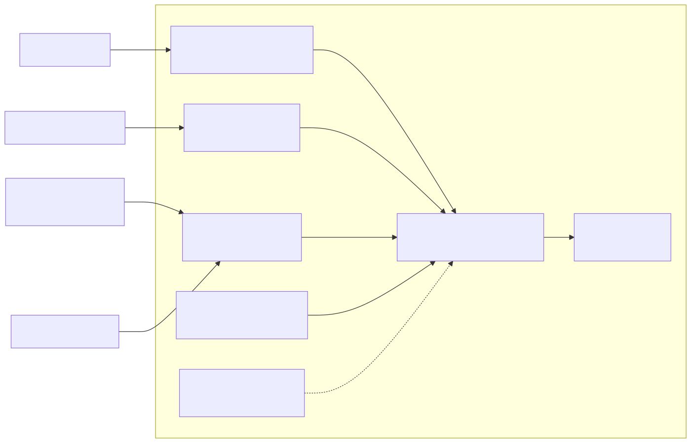 | 公司机：systemd `kanban` · nginx · 主端口 `127.0.0.1:8018` · 候选预热可用 `:8019` |
| 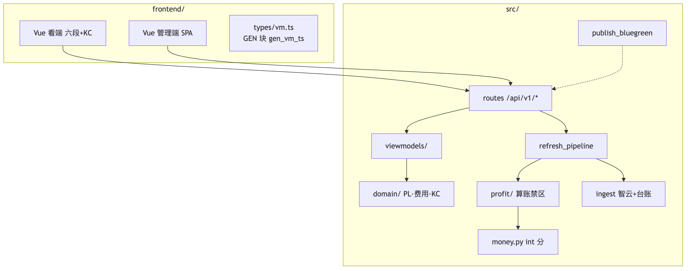 | 模块关系 |
| 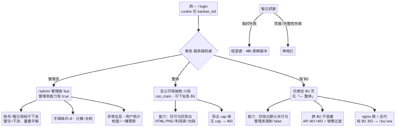 | 登录与权限 |
| 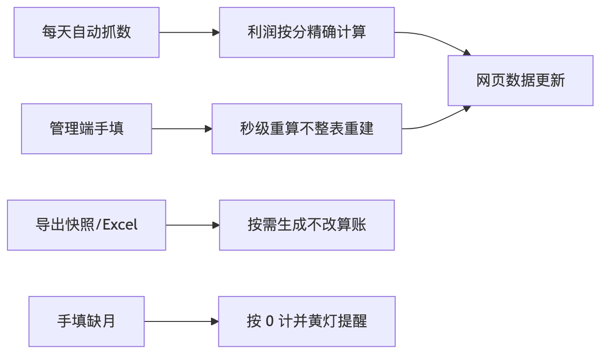 | 每天怎么跑 |
| 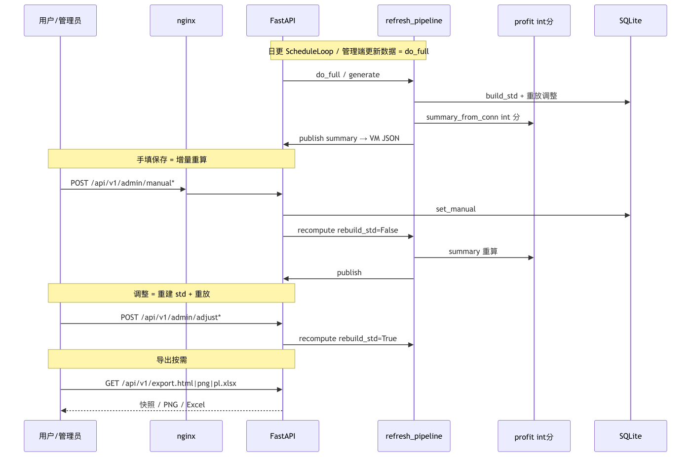 ·  | 关键时序与数据模型 |

库内存金额用「分」整数，避免浮点误差；账号与 BU 配置在 JSON 文件里，不在业务库表中。  
图注清单：[docs/images/FIGURES.md](docs/images/FIGURES.md) · 矢量源：[docs/设计图/](docs/设计图/)

装机步骤：[docs/Ubuntu部署手册.md](docs/Ubuntu部署手册.md) · 排障：[docs/Runbook.md](docs/Runbook.md)

---

## 目录导读

```text
run.py                 更新管道 / 启动服务
config.json            税率、文件名、刷新时刻等出厂默认（机器差异写 数据/本地配置.json）
VERSION                当前产品版本号（管理端展示读这里）
CHANGELOG.md           变更记录
frontend/              Vue 源码与构建产物 dist/
src/                   抓数、库、算账、HTTP 路由、一键更新等
static/                登录页、主题、导出用 HTML 模板等
数据/                  本机业务数据与账号（gitignore，不进仓库）
tests/                 回归与契约测试
docs/                  使用手册、部署、API、设计图、界面截图
deploy/linux/          nginx / systemd 模板与发版脚本
```

| 路径 | 职责 |
|------|------|
| `src/ingest/` | 智云/台账抓取与清洗（**`fetch_zhiyun.py` 业务降级点勿改**） |
| `src/db*` / `src/domain/` | 入库、金额「分」、领域计算 |
| `src/profit/` | 算账引擎（口径禁区） |
| `src/routes/` | HTTP：登录、驾驶舱、管理端、导出 |
| `src/notify.py` + `src/alert_store.py` | **本机**告警（零外发；飞书 webhook 已废止） |
| `frontend/src/` | Vue 看端 + 管理端 |
| `tests/run_verify.sh` | 一键门禁 |
| `deploy/linux/` | systemd / nginx / 发版脚本 |

一键更新（管理端「检查更新」）：对配置的 git 远端 `fetch`，落后时 `git pull --ff-only`，依赖变化会装包，再由看门狗重启服务。工作区被改脏会拒绝更新，以免覆盖人工改动。  
**注意**：若本次变更含 `deploy/linux/nginx-kanban.conf`，一键更新**不会**自动改系统 nginx——须运维手动同步 conf 并 `reload`。

---

## 生产运维

> 生产机日常「说明书首页」。故障逐步处方以 [docs/Runbook.md](docs/Runbook.md) 为准；装机从零见 [docs/Ubuntu部署手册.md](docs/Ubuntu部署手册.md)。

### 1. 访问入口（只发这两个）

| 场景 | 地址 | 说明 |
|------|------|------|
| **公司办公区（内网）** | `http://192.168.30.46` | 有线/无线办公网 |
| **内外网统一（首选）** | `http://dash.besteasy.com:8001` | 海鹏映射；**必须带 `:8001`** |
| **公司外 · 旧公网 IP** | `http://101.254.102.94:8001` | 过渡期；办公区内用旧公网 IP 打不开是正常的（NAT 回流） |

- **登录页（唯一）**：`/login`（未登录访问 `/`、`/admin` 也会到这里）
- **管理功能**：登录管理员账号后进入 `/admin`（**没有**单独的管理员登录网址）
- **不要**给业务负责人发 `/admin` 或一长串 `/bu/…`——根地址 + 各自账号即可
- 外网 IP/端口由 IT 防火墙映射固定；**改机 IP 或 nginx 监听端口前先问 IT**

### 2. 生产机长什么样

| 项 | 值 |
|----|-----|
| 代码目录 | `/opt/kanban/看板正式程序`（git，跟踪 `main`） |
| 应用进程 | `systemd` 单元 **`kanban`** · User=`lee` · 主端口 **`127.0.0.1:8018`** |
| 对外 | 首选 **`dash.besteasy.com:8001`**；nginx 静态 `frontend/dist` + 反代 API |
| 日更 | 进程内 **ScheduleLoop**（时刻以管理端 `schedule_times` 为准；每个时点各自完整刷新） |
| 发版 | `deploy/linux/publish_kanban.sh --pull`：强制库备份 → 可选 **:8019 候选预热** → health/runtime 对齐后切主 |
| 其它 cron | 小时 healthcheck、每日备份（**不要**靠 cron `run.py --scheduled` 刷新页面内存） |
| 远程运维 | 家：`ssh kanban-home`；公司内网：`ssh kanban-lan`（密钥与跳板见工作区本地档案，**不进本仓**） |

### 3. 日常命令（在部署机上）

```bash
# 是否活着
systemctl is-active kanban nginx
curl -s -o /dev/null -w '%{http_code}\n' http://127.0.0.1/api/v1/health
curl -s http://127.0.0.1/api/v1/health   # 看 built_at / 灯色

# 版本
cd /opt/kanban/看板正式程序 && cat VERSION && git rev-parse --short HEAD

# 拉代码（无脏工作区）
cd /opt/kanban/看板正式程序 && git pull --ff-only
# 应用自愈：向主进程发 SIGTERM，systemd 会拉起（或 sudo systemctl restart kanban）

# 日志
journalctl -u kanban -n 80 --no-pager
# 应用/前端错误：数据/日志/ 、数据/前端错误.log
```

管理端也可：「更新数据」（重跑管道写内存）、「检查更新 / 一键更新」（git 升级程序）。

### 4. nginx 铁律（必守）

**根路径 `location = /` 必须 `proxy_pass` 到后端**，禁止：

```nginx
# ❌ 错误：dist 有 index.html 时永远不走后端
location = / { try_files /index.html @backend; }
```

正确形态见仓库模板 [`deploy/linux/nginx-kanban.conf`](deploy/linux/nginx-kanban.conf)：

- `location = /` → `proxy_pass http://kanban_api`（后端对纯 BU 会话 **303 → `/bu/xxx`**）
- `location /` 仍可 `try_files` 托管其它 SPA 资源
- `/api` `/admin` `/login` `/bu` `/export.*` 反代后端

**改完 conf 必须落地并 reload**（一键更新不会替你做）：

```bash
cd /opt/kanban/看板正式程序
sudo cp deploy/linux/nginx-kanban.conf /etc/nginx/sites-available/kanban
sudo nginx -t && sudo systemctl reload nginx
# 核：应见 proxy_pass，不应在 location = / 里出现 try_files /index.html
grep -A12 'location = /' /etc/nginx/sites-enabled/kanban | head -15
```

前端另有双保险：纯 BU 打开 `/` 或整体 cockpit **403** 会回流本账号业务线（仍建议 nginx 层一次做对）。

### 5. 发版后浏览器

- `index.html` 为 `no-store`；带 hash 的 `/app/assets/*` 长缓存；**theme.css 带 `?v=` 产品版本**
- 管理端发版后若白屏 /「Failed to fetch dynamically imported module」：让用户 **强制刷新**（Ctrl/Cmd+Shift+R）或清缓存
- 标准发版：部署机 `bash deploy/linux/publish_kanban.sh --pull`（可选 `--nginx-cutover`）；细节见 Runbook

### 6. 坏了先看哪

| 现象 | 先查 |
|------|------|
| 完全打不开 | `systemctl status kanban nginx`；`curl` 本机 `:80` / `:8018` |
| 业务线「第一次能进、再开根地址进不去」 | nginx `location = /` 是否仍 `try_files index`（§4） |
| 页面数据不随「到点」变 | `/api/v1/health` 的 `built_at`；日志是否有 `schedule_loop`；管理端是否点过「更新数据」 |
| 体检黄/红 | 管理端控制台详情；手填缺月 / 未抓到源等（黄≠服务挂了） |
| 一键更新被拒 | 工作区是否脏（如把日志写进了代码目录） |

完整处方卡 → [docs/Runbook.md](docs/Runbook.md)。

### 7. 敏感信息边界

| 可写本 README / 公开仓 | 不可写入本仓 |
|------------------------|--------------|
| 内网 IP、外网入口形态、命令模板 | sudo 口令、SSH 私钥、智云/看板业务密码、真实金额与客户表 |

口令与跳板细节只放工作区本地「公司电脑（部署机）」档案（gitignore / 不上云）。

---

## 文档地图

| 你想… | 去读 |
|--------|------|
| **线上运维 / 入口 / nginx** | **本节 [生产运维](#生产运维)** · [docs/Runbook.md](docs/Runbook.md) |
| 给同事讲怎么点页面 | [docs/用户手册/](docs/用户手册/)（看板 · 管理端 · FAQ） |
| 弄清六源字段与进料 | [docs/数据来源说明.md](docs/数据来源说明.md) |
| 在 Ubuntu 上装 / 升级 | [docs/Ubuntu部署手册.md](docs/Ubuntu部署手册.md) |
| 看端 API / 渲染约定 | [docs/api-v1-cockpit.md](docs/api-v1-cockpit.md) · [docs/api/](docs/api/) |
| 接口与库表清单 | [docs/softeng/](docs/softeng/) |
| 为什么这样设计 | [docs/madr/](docs/madr/) |
| 系统教学向总览 | [docs/系统教学说明_甲骨易智能经营罗盘_v1.md](docs/系统教学说明_甲骨易智能经营罗盘_v1.md) |
| 文档总索引 | [docs/README.md](docs/README.md) |

---

## 质量与发布约定

- 核心数字有回归基准：库内计算结果与基准 JSON 对齐；多周期金额一致性有自动化检查
- **前端展示串由后端给出**，浏览器不做金额运算，避免口径漂移
- 发布只走 `main`；推远端前会检查是否误带真实金额、客户名、账号口令等敏感内容
- 公开仓库**不推送** git tag / GitHub Release（版本以 `VERSION` + `CHANGELOG` 为准）
- 全量自检：在项目根、**优先 `.venv/bin/python`**，`KANBAN_OFFLINE=1 sh tests/run_verify.sh`；启动时会物化脱敏 `_golden_data`。判绿看真实退出码，勿用 `| tail` 假绿

---

## 许可证与数据安全

本仓库代码用于甲骨易内部经营看板。  
**请勿**把 `数据/` 下的真实 Excel、数据库、账号文件提交进 git 或发到公开渠道。演示截图仅使用本地 golden / 离线样例数据生成。
