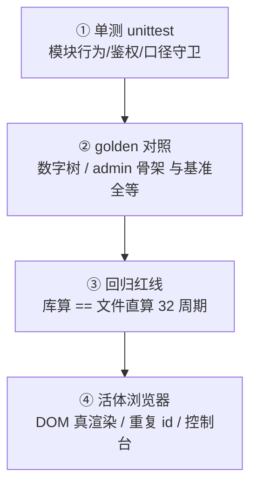

# 07 · 测试策略：四层防线

> 产品 **v1.5.0-beta** · 规模（从代码数）：**26** 个 `tests/test_*.py`，**426** 个 `def test_`，+ 回归红线 32 周期。  
> 全量说明表：`05_测试说明_回归红线与验收.md` · 程序仓副本：`docs/测试说明_v1.5补充.md`。

## 四层各防什么



| 层 | 防什么 | 为什么缺一不可 |
|----|--------|----------------|
| 单测 | 接口契约、鉴权、纯函数边界 | 改一行马上炸；但**看不见 DOM** |
| golden | API 数字、页面骨架漂移 | 防「悄悄改了序列化/HTML 结构」 |
| 回归红线 | 入库/清洗破坏利润数字 | 财务红线：数字一分不能偏 |
| 活体浏览器 | 真页面空白、id 撞车、样式裁切 | **单测全绿仍可能页空白** |

## 真实案例 1：`dTbl` 撞车（v1.3.1）

- **现象**：去税率表接口有数据，页面空白。  
- **原因**：去税表 id 与明细表 id 都叫 `dTbl`，`getElementById` 命中折叠里 height=0 的那张。  
- **教训**：接口/单测/grep 全绿 ≠ 用户看见；必须看 DOM；并加**全页重复 id 扫描**。

## 真实案例 2：`| tail` 假绿（v1.2.2）

- **现象**：`run_verify | tail` 退出码 0，其实前面测试已红。  
- **原因**：管道退出码变成 tail 的 0；`set -e` 停在第一个失败文件。  
- **教训**：判绿只看真实退出码（铁律20）；逐文件扫 FAIL。

## 怎么跑

```bash
KANBAN_OFFLINE=1 sh tests/run_verify.sh; echo $?
for f in tests/test_*.py; do .venv/bin/python "$f" || echo FAIL $f; done
```
