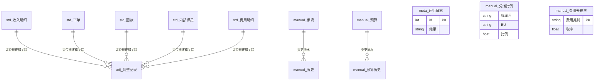

# 08 · 数据库设计（对齐 `src/schema.py`）

> **产品 v1.5.0-beta** · 唯一 DDL 源：`程序/看板正式程序/src/schema.py`  
> **统计**：标准表 **5** + 人工/元数据表 **10** = **15** 张业务表（另：连接时 `DROP TABLE IF EXISTS suspect_待确认` 已废弃）。  
> **库文件**：`数据/看板.db`（gitignore，部署机本地）。无独立 DB 服务。  
> 配图：同目录 `03_详细设计_数据库ER图.svg`（v1.2）+ 程序仓 `docs/images/er.png`。

## 一、三类哲学

| 前缀 | 含义 | 重建策略 |
|------|------|----------|
| `std_` | 程序从进料口规范化后的**标准事实** | 每次更新**全量重建**，永不手改 |
| `adj_` | **调整指令**（改值/剔除），只追加 | 重建不清；重抓后重放 |
| `manual_` / `meta_` | 手填、预算、分摊、去税、配置留痕、运行日志 | 重建不清 |

无物理外键：调整用 `(目标表, 定位键, 字段)` 逻辑关联 std 行。

## 二、标准表 std_*（5）

| 表 | 主键 | 关键字段 | 进料来源 |
|----|------|----------|----------|
| `std_收入明细` | id 自增；定位键=内容哈希 | 订单号、客户、业务线、销售、整单交付日期、交付额、项目成本、归属月、原值_*、已删除 | 智云·项目明细 |
| `std_下单` | 同上 | 订单号、下单日期、下单预估额、部门、销售、归属月… | 智云·下单 |
| `std_回款` | 同上 | 回款ID、到账日期、到账金额、客户、销售… | 智云·回款 |
| `std_内部译员` | 同上 | 任务ID、任务提交日期、结算金额、译员类型、销售… | 智云·任务 |
| `std_费用明细` | 同上 | 收单月/日、含税金额、业务BU、对应报表大类、预算明细费用类型、预算归属部门… | 收单台账 Excel |

**约定**：金额 REAL（元）；日期 TEXT ISO；归属月 `YYYY-MM`；`已删除=1` 为剔除软删。

## 三、人工表（10）

| 表 | 主键 | 用途 |
|----|------|------|
| `adj_调整记录` | id | 改值/剔除；状态 生效/过期疑似/已撤销 |
| `manual_手填` | (归属月, 项目) | 全公司手填项；**当月未填=0**（实现口径，见需求台账补记） |
| `manual_手填BU` | (归属月, 范围, 项目) | 按 BU 范围手填 |
| `manual_分摊比例` | (归属月, BU) | 公共费用按月比例 0~100；可&lt;100% |
| `manual_费用去税率` | 费用类别 | 全局一套税率%；空=不去税 |
| `manual_历史` | id | 手填变更流水 |
| `manual_预算` | (年份, 指标, 范围) | 下单/回款目标等 |
| `manual_预算历史` | id | 预算变更流水 |
| `meta_运行日志` | id | 触发方式、绿/黄/红、体检 JSON |
| `manual_配置变更` | id | 管理端配置摘要留痕（不存密码明文） |

## 四、库外配置（非 SQLite）

| 文件 | 内容 |
|------|------|
| `数据/看板账号.json` | 登录账号、权限、密码明文 |
| `数据/BU配置.json` | BU 名 + 销售名单 |
| `数据/智云配置.json` | 智云凭据 |
| `数据/本地配置.json` | 机器专属覆盖（台账路径、调度等）；程序不写 `config.json` |

## 五、mermaid ER（简化）

**看图要点**：std 与 adj 无 FK 线在 SQLite 里；分摊/去税是全局人工配置，被 profit 读取后叠到费用。
