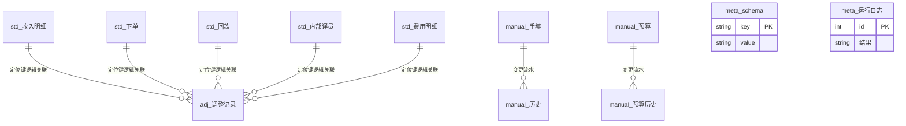

# 08 · 数据库设计（对齐 `src/schema.py` · 任务书33 修订）

> **产品 v1.5.0-beta** · 唯一 DDL 源：`程序/看板正式程序/src/schema.py`  
> **SCHEMA_VERSION = 2**（1→2：金额 REAL 元 → INTEGER **分**）  
> **统计**：标准表 **5** + 人工/元数据表 **11**（含 `meta_schema`）= **16** 张。  
> **库文件**：`数据/看板.db`（gitignore）。无独立 DB 服务。  
> 配图：`docs/images/er.png`（金额单位以本文为准）。

## 一、三类哲学

| 前缀 | 含义 | 重建策略 |
|------|------|----------|
| `std_` | 程序从进料口规范化后的**标准事实** | 每次更新**全量重建**，永不手改 |
| `adj_` | **调整指令**（改值/剔除），只追加 | 重建不清；重抓后重放 |
| `manual_` / `meta_` | 手填、预算、分摊、去税、配置留痕、运行日志、schema 版本 | 重建不清 |

无物理外键：调整用 `(目标表, 定位键, 字段)` 逻辑关联 std 行。

## 二、金额：INTEGER 分（SCHEMA v2）

| 规则 | 说明 |
|------|------|
| 存储 | 金额列 **INTEGER，单位：分** |
| 进料 | xlsx 元值 → `decimal.Decimal` → `ROUND_HALF_UP` → 分（`src/money.py`） |
| 算账 | `db.load_*` **读回元 float** 交给 `profit`（显示层再 fmt） |
| 禁止 | `float × 100` 直乘入库 |
| 迁移 | `migrate_money_to_fen_if_needed`：版本门控、幂等、迁移前备份 `*.bak-fen-*` |
| 定位键 | **normalize 用元算哈希**，再转分入库 → 哈希不因分存储漂移 |
| adj 原值/新值 | 仍为 **元 TEXT**（人类可读）；重放时分↔元换算 |

**非金额 REAL 不动**：分摊比例、去税率仍为百分数 REAL。

## 三、连接与事务边界

| 项 | 约定 |
|----|------|
| WAL | `PRAGMA journal_mode=WAL`（写不挡读） |
| 忙等 | `busy_timeout=5000` ms |
| 同步 | `synchronous=NORMAL` |
| std 重建 | **单事务**：`BEGIN IMMEDIATE` → 清表 + 全表 INSERT → `COMMIT`；失败 `ROLLBACK` 保留旧数据 |
| 中间 commit | 重建链路上**禁止**清表后单独 commit |
| 完整性 | 管道末 `PRAGMA quick_check`；失败 → 运行结果**红** |
| 备份 | 每日滚动 `数据/备份/看板_YYYYMMDD.db`；失败入 `run_reasons` |

## 四、标准表 std_*（5）

| 表 | 主键 | 关键金额列（分） | 定位键 |
|----|------|------------------|--------|
| `std_收入明细` | id | 交付额、项目成本 | SOD 自然键优先 |
| `std_下单` | id | 下单预估额 | 订单号优先 |
| `std_回款` | id | 到账金额 | 回款ID 优先 |
| `std_内部译员` | id | 结算金额 | 任务ID 优先 |
| `std_费用明细` | id | 含税金额 | 行哈希（含金额**元**字符串等） |

日期 TEXT ISO；归属月 `YYYY-MM`；`已删除=1` 软删。

### 定位键重复（A4）

两行内容完全相同 → 同定位键。

| 场景 | 行为 |
|------|------|
| 写调整 `add_adjustment` | 命中 >1 行 → **拒绝** |
| 重放 `apply_adjustments` | 命中 >1 行 → **过期疑似**、不套用 |
| 体检 | `audit_duplicate_locators` 有重复 → **黄** |

## 五、人工表

| 表 | 金额列 | 说明 |
|----|--------|------|
| `adj_调整记录` | 原值/新值 TEXT（元） | 非 INTEGER 分 |
| `manual_手填` / `manual_手填BU` | 金额 INTEGER 分 | 当月未填=0 |
| `manual_历史` | 旧值/新值 分 | |
| `manual_预算` / `manual_预算历史` | 金额 分 | 比率类指标亦×100 存（数值同构） |
| `manual_分摊比例` | 比例 REAL | 非金额 |
| `manual_费用去税率` | 税率 REAL | 非金额 |
| `meta_schema` | key/value | `version`=SCHEMA_VERSION |
| `meta_运行日志` | 体检JSON | 含 backup / db_check / duplicate_locators |
| `manual_配置变更` | — | 不存密码 |

## 六、库外配置（非 SQLite）

| 文件 | 内容 |
|------|------|
| `数据/看板账号.json` | 登录账号（gitignore） |
| `数据/BU配置.json` | BU + 销售名单 |
| `数据/智云配置.json` | 智云凭据/覆盖 |
| `数据/本地配置.json` | 机器专属；程序不写 `config.json` |

## 七、mermaid ER（简化）

**修订记录**：2026-07-16 任务书33 — 整数分 + WAL + 单事务重建 + 重复定位键行为 + quick_check。
