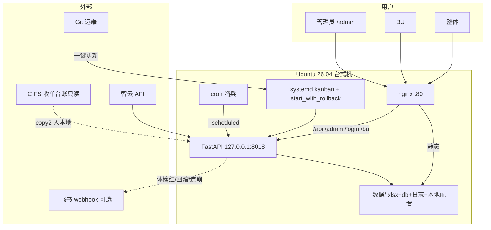

# 09 · 部署架构说明

> 产品 **v2.0.1** · 2026-07-20 · 配图：`docs/设计图/04_部署与运行拓扑图.svg` + `docs/images/deploy.png`  
> **主线 Ubuntu 26.04**（systemd kanban + nginx:80 + cron）；Windows 线已退役（任务书54）。  
> 版本以仓库根目录 `VERSION` 为准；变更史见根目录 `CHANGELOG.md`。

## 双模式

| 模式 | 对外 | 后端 | 静态 |
|------|------|------|------|
| **nginx 生产（推荐）** | :80 | `127.0.0.1:8018`，`serve_static=false` | nginx 伺服 `frontend/dist` + `/static` |
| **直连（开发/兼容）** | :8018 | `0.0.0.0:8018`，`serve_static=true` | FastAPI 挂 dist/static |

模板：`deploy/linux/nginx-kanban.conf`（**已进仓**）。systemd 环境变量见 `deploy/linux/kanban.service`。

## `static/` 目录角色与存续原因

> 与 MADR 0014（删 legacy shell）对齐：**shell 退役 ≠ `static/` 整体废弃**。

| 路径 | 角色 | 谁读 |
|------|------|------|
| `static/templates/` | 服务端 HTML 碎片（约百份） | `tpl.py` / `render_*.py`；`python run.py` 出单文件 HTML 快照 |
| `static/css/theme.css` | **主题 CSS 唯一源**（看端/导出同源） | `theme.py`、构建与部分管理端样式引用 |
| `static/admin/` | 首次部署引导 `bootstrap.html`（65：legacy admin.js 已删，主 UI=Vue） | nginx/FastAPI 静态挂载 |
| 登录/错误页 HTML | `admin_login.html` / `view_login.html`、错误页模板 | 鉴权与异常页 |

**与 `frontend/dist` 的关系**：生产看端/管理端主 UI 是 Vue dist；`static/` 补齐模板渲染路径、登录错误页与主题源。新开发勿把 `static/` 当死代码整夹删除——真清理须另立任务并跑全量 `run_verify`。

## 组件关系



## 日常循环

1. cron → `--scheduled` → 管道末尾清理运行日志 / 月末 VACUUM  
2. 用户只访问 **:80**（生产）或 **:8018**（直连）  
3. 管理端：设置页飞书 webhook、**导出归档**、备份天数  
4. 一键更新失败/依赖回滚 → 飞书（若已配）；启动即崩 → 看门狗回滚并告警  

## 回滚

```bash
cd /opt/kanban/看板正式程序
git reset --hard <好commit>
sudo systemctl restart kanban
```

## 防火墙 / 安全

- ufw：放行 **80**；**8018 仅本机**  
- fail2ban：SSH  
- 禁休眠：见 Ubuntu 部署手册附录  

## 部署形态 MADR（更新 · 任务书43）

| 形态 | 默认？ |
|------|--------|
| **nginx :80 + API 回环** | **是（Ubuntu 生产）** |
| 直连 :8018 挂 static | 开发 / 无 nginx / Windows legacy |
| 真跨域双端口 | 不做默认 |

配置进仓：`deploy/linux/nginx-kanban.conf`；安装时 sed 改 root 路径。
