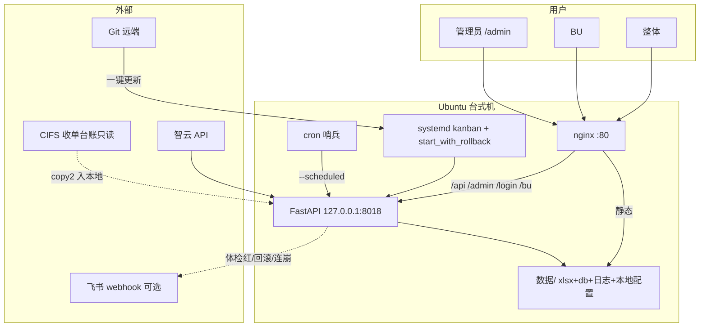

# 09 · 部署架构说明

> 产品 **v1.6.0-beta** · 任务书43 · 配图：`docs/设计图/04_部署与运行拓扑_v1.6.svg`（mermaid 源同目录 `.mmd`）  
> **主线 Ubuntu 22.04**；Windows 看门狗/计划任务 **legacy**。

## 双模式

| 模式 | 对外 | 后端 | 静态 |
|------|------|------|------|
| **nginx 生产（推荐）** | :80 | `127.0.0.1:8018`，`serve_static=false` | nginx 伺服 `static/` |
| **直连（开发/兼容）** | :8018 | `0.0.0.0:8018`，`serve_static=true` | FastAPI 挂 `/static` |

模板：`deploy/linux/nginx-kanban.conf`（**已进仓**）。systemd 环境变量见 `deploy/linux/kanban.service`。

## 组件关系



## 日常循环

1. cron → `--scheduled` → 管道末尾清理运行日志 / 月末 VACUUM  
2. 用户只访问 **:80**（生产）或 **:8018**（直连）  
3. 管理端：设置页飞书 webhook、**导出归档**、备份天数  
4. 一键更新失败/依赖回滚 → 飞书（若已配）；启动即崩 → 看门狗回滚并告警  

## 回滚

```bash
cd /opt/kanban/看板正式程序
git reset --hard <好commit>
sudo systemctl restart kanban
```

## 防火墙 / 安全

- ufw：放行 **80**；**8018 仅本机**  
- fail2ban：SSH  
- 禁休眠：见 Ubuntu 部署手册附录  

## 部署形态 MADR（更新 · 任务书43）

| 形态 | 默认？ |
|------|--------|
| **nginx :80 + API 回环** | **是（Ubuntu 生产）** |
| 直连 :8018 挂 static | 开发 / 无 nginx / Windows legacy |
| 真跨域双端口 | 不做默认 |

配置进仓：`deploy/linux/nginx-kanban.conf`；安装时 sed 改 root 路径。
