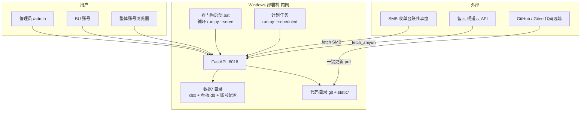

# 09 · 部署架构说明

> 产品 **v1.5.0-beta** · 配图：`04_部署与运行拓扑图.svg` + 程序仓 `docs/images/deploy.png`  
> **v1.5 部署流程不变**（仍看门狗 + 一键更新；管理端静态资源随 git pull）。

## 组件关系



**看图要点**：常驻只有看门狗里的 serve；管道跑完即退；数据与凭据只在部署机 `数据/`。

## 日常循环

1. 计划任务到点 → `--scheduled` → 抓数→清洗→算→写缓存 HTML/summary  
2. 用户浏览器始终访问 :8018（昨日页在管道失败时仍可看，取决于状态）  
3. 管理端点「更新数据」→ 异步 refresh + 轮询  
4. 「一键更新」→ `git pull --ff-only` → 退出码 42 → 看门狗重启  

## 回滚

```text
git checkout 393c04b   # 或某安全 commit
# 再双击 看门狗启动.bat
```

管理端/看端内嵌回退：`KANBAN_LEGACY_INLINE=1`。
