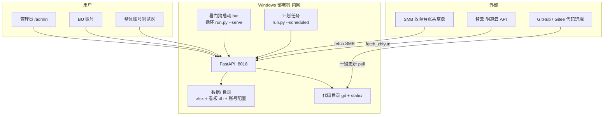

# 09 · 部署架构说明

> 产品 **v1.5.0-beta** · 配图：`04_部署与运行拓扑图.svg` + 程序仓 `docs/images/deploy.png`  
> **v1.5 部署流程不变**（仍看门狗 + 一键更新；管理端静态资源随 git pull）。

## 组件关系



**看图要点**：常驻只有看门狗里的 serve；管道跑完即退；数据与凭据只在部署机 `数据/`。

## 日常循环

1. 计划任务到点 → `--scheduled` → 抓数→清洗→算→写缓存 HTML/summary  
2. 用户浏览器始终访问 :8018（昨日页在管道失败时仍可看，取决于状态）  
3. 管理端点「更新数据」→ 异步 refresh + 轮询  
4. 「一键更新」→ `git pull --ff-only` → 退出码 42 → 看门狗重启  

## 回滚

```text
git checkout 393c04b   # 或某安全 commit
# 再双击 看门狗启动.bat
```

看端/管理端均外置 static；紧急回退用 git。unittest 下整体页仍直出 HTML 便于断言。

---

## 部署形态（MADR · 任务书36·F）

### 状态
**Accepted**（2026-07-16 · 明昊选项 A）

### 背景
看端/管理端已前后端分离（`static/` + FastAPI API）。需要在「省部署成本」与「未来可拆静态 CDN/反代」之间定默认形态，并用 CI 证明分离能力仍在。

### 决策

| 形态 | 说明 | 默认？ |
|------|------|--------|
| **同端口** | FastAPI 挂 `/static` + 全部 `/api` + shell；浏览器只访问 `http://部署机:8018/` | **是（生产）** |
| **可选 nginx 反代** | 对外 80/443：`/`→静态目录或反代到 8018，`/api`→8018；TLS 终止在 nginx | 可选 |
| **真跨域双端口** | 静态一个源、API 另一源 | **不做默认**；需 HTTPS + Cookie `SameSite=None; Secure` + CORS 凭据，成本高 |

### 理由
1. 内网 5 用户级规模，同端口零跨域、零额外证书与运维。
2. `static/**/*.js|html` API 调用一律**相对路径**（或同源），无硬编码 `http://host:port`；`tests/test_split_static.py` 证明 `static/` 可在另一端口用 stdlib `http.server` 独立伺服 shell/JS（**边界**：登录会话同源限制属预期，本测不证跨域登录）。
3. 真要拆域时再上 HTTPS 与 SameSite 策略，避免内网 HTTP 半吊子跨域。

### 后果
- 部署手册 / 看门狗只教同端口 8018。
- 分离回归靠 `test_split_static`；不强制 nginx 配置进仓。
