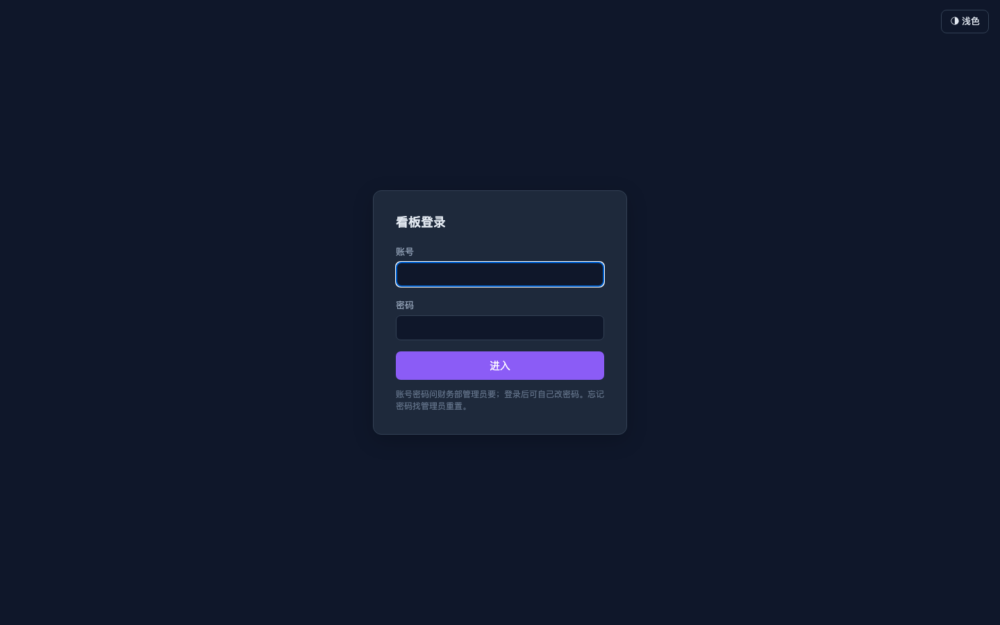
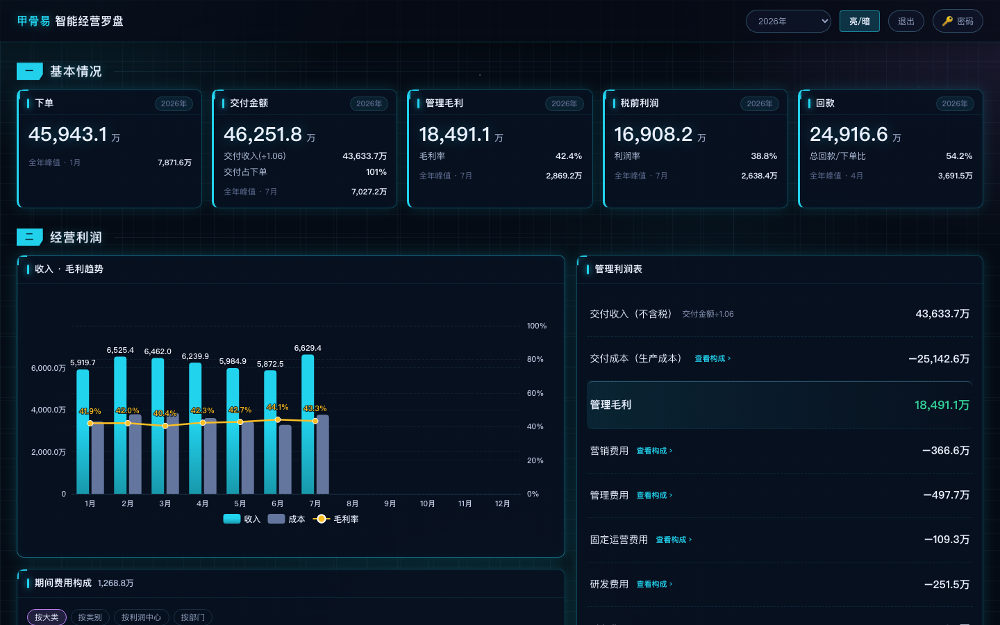

# 看板使用手册

**这篇解决什么问题**：第一次打开「智能经营罗盘」时，知道从哪进、每一屏看什么、怎么换时间段。

> 截图均在本机合成数据环境拍摄（`_golden_data`），**不含真实客户与真实金额**。见 `docs/用户手册/截图/`。

---

## 1. 怎么打开

1. 用电脑浏览器打开财务内网地址（上线后由管理员告知，本机试用是 `http://本机IP:8018/`）。
2. 输入账号和密码，点 **登录**。
3. 登录后进入整体看板；若账号只看某个业务线（BU），会直接进该 BU 页。

---

## 2. 首页五块在说什么

从上到下通常是：

| 区块 | 你看什么 |
|------|----------|
| **基本情况** | 下单、交付、毛利、税前利润、回款五张卡 |
| **经营利润** | 收入/成本趋势 + 管理利润表（可点「查看构成」） |
| **收入与毛利结构** | 按客户、按销售的排名条 |
| **下单与回款** | 回款图 + 排名 |
| **费用明细** | 上方热力格子图 + 台账明细表（可翻页、筛选） |

### 2.1 费用热力格子图（怎么看）

- 位置：板块「五 · 费用明细」最上方，标题 **费用热力 · 月份×报表大类**。
- **横轴** = 有数的月份；**纵轴** = 报表大类（与费用趋势同一套分类）。
- **格子颜色深浅** = 该月该大类金额大小（青偏浅 → 金偏深）；**悬停**格子可看金额显示串。
- 数字全部来自后台已算好的显示串，**页面不做加减乘除**。
- 手机窄屏可左右横滚看完整格子。

> 截图证据见 `docs/验收证据/20260719_54p14/live/heatmap.png`（合成/内网环境）。

---

## 3. 换时间段

- 顶栏点当前周期，弹出 **年 / 季 / 月 / 自定义区间** 两段式选择（月份多时也不会被下面卡片挡住）。
- 切换后，五张卡和利润表数字会跟着变；**页面不应整页乱跳**。
- 若做了「按时间段查询」，排名卡会标出查询区间。
- 右上角 **浅色/深色** 一切即换（图表与管理端内容同步，不必刷新整页）。

---

## 4. 业务线（BU）页

- 顶栏或 BU 分页可进某条业务线。
- 只显示该业务线的数字，**看不到其他业务线的客户/人员**。
- 点 **← 整体** 回到全公司。

---

## 5. 手机

- 用手机浏览器打开同一地址即可（建议公司 Wi‑Fi）。
- 窄屏时卡片会竖着排；功能与电脑相同，操作面积更紧。

---

## 6. 退出

- 点右上角 **退出**。
- 退出后再刷新，需要重新登录。

---

## 还不会？

看同目录 `FAQ.md`，或联系财务部管理员（看板维护岗）。
