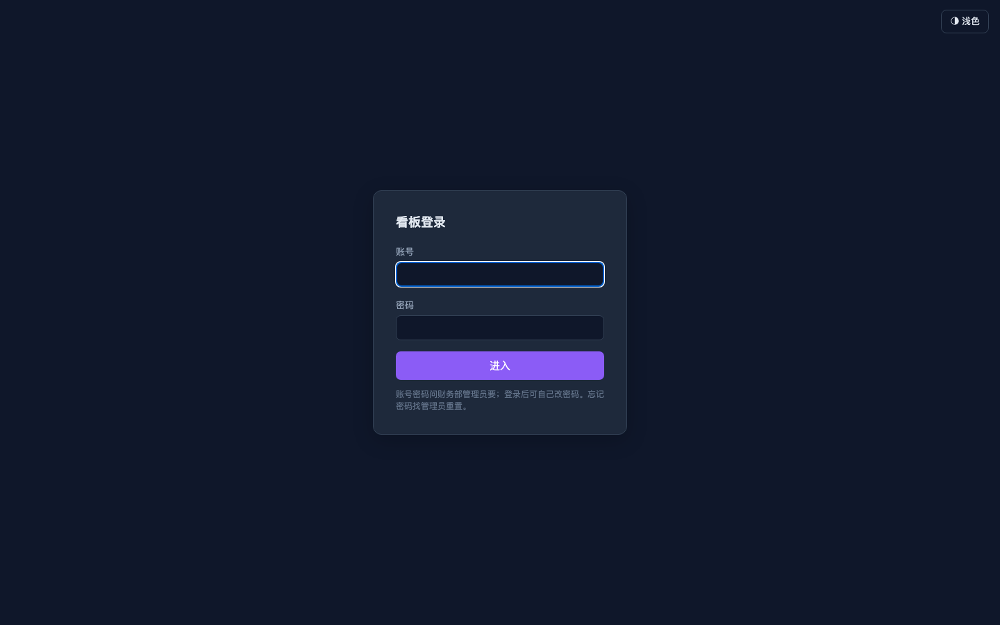

# 看板使用手册

> **版本对齐（2026-07-31）**：产品 **v3.6.3**（以根目录 `VERSION` 为准）。统一登录；会话仅 **`kanban_sid`**（须重登后只认此 cookie）；看数 Domain→VM→Vue；KPI 交付金额小字「含税」、副行「不含税 · ÷1.06」。首屏六段顺序见下表；重点客户为独立第三章。

**这篇解决什么问题**：第一次打开「经营看板」时，知道从哪进、每一屏看什么、怎么换时间段。

> 截图均在本机合成数据环境拍摄（`_golden_data`），**不含真实客户与真实金额**。见 `docs/用户手册/截图/`。部分截图仍可能来自较早演示批次，**板块顺序与主路径以本文 + 现行页面为准**。

---

## 1. 怎么打开

**全员优先只记一个域名（用自己的账号登录即可；不要记一长串带 `/bu/` 的链接）：**

| 场景 | 地址 |
|------|------|
| **内外网统一（2026-07-30 起首选）** | `http://dash.besteasy.com:8001`（**必须带端口 8001**） |
| **公司办公区 · 旧内网** | `http://192.168.30.46` |
| **公司外 · 旧公网 IP** | `http://101.254.102.94:8001` |

说明：优先收藏域名入口。旧公网 IP 在公司 WiFi/有线里**打不开是正常的**，那时请用域名或内网。关掉浏览器再开、或收藏根地址，业务线账号也会自动进入自己的业务线（2.4.3 已加固）。

1. 用电脑浏览器打开上表对应地址（本机开发试用仍是 `http://本机IP:8018/`）。
2. 进入**同一登录页**，输入账号和密码，点 **进入**（无单独管理员登录页；会话 cookie 仅 **`kanban_sid`**，升级后若进不去请重新登录）。
3. 登录后自动分流：管理员 → **管理后台**（路径 `/admin`，设置/更新/账号都在这里，**不在**经营看板看数页顶栏）；整体权限 → 公司看板；业务线 → 自己的业务线页。

---

## 2. 首页六段在说什么

从上到下（**整体页 = 业务线页**同一顺序，3.6.1）：

| 序号 | 区块 | 你看什么 |
|------|------|----------|
| **一** | **基本情况** | 下单、交付、毛利、税前利润、回款五张卡 |
| **二** | **下单与回款** | 日查区间（含「昨天」）· 柱图 · 下单/回款双榜 |
| **三** | **重点客户下单情况追踪** | 独立章节：六档经营池、客户数/金额双饼、名单分页、连续月折线（**不再**挂在下单与回款最底） |
| **四** | **经营利润** | 收入/成本趋势 + 管理利润表（可点「查看构成」） |
| **五** | **收入与毛利结构** | 按客户、按销售的排名条 |
| **六** | **费用明细** | 上方热力格子图 + 台账明细表（可翻页、筛选）；明细区为**日历起止日期**（按收单日期到日）+「查询 / 本月 / 返回本年」，默认本年全年；「本月」=当月1日～今天；该区间**只影响明细表**（热力/费用折线仍按全年月度）；**默认仅期间费用大类**（与图表口径一致），可勾「显示全部台账记录」看全量；导出跟随当前日期区间与口径 |

### 2.1 费用热力格子图（怎么看）

- 位置：板块「**六 · 费用明细**」最上方，标题 **费用热力 · 月份×报表大类**。
- **横轴** = 有数的月份；**纵轴** = 报表大类（与费用趋势同一套分类）。
- **格子颜色深浅** = 该月该大类金额大小（青偏浅 → 金偏深）；**悬停**格子可看金额显示串。
- 数字全部来自后台已算好的显示串，**页面不做加减乘除**。
- 手机窄屏可左右横滚看完整格子。

> 截图证据见 `docs/验收证据/20260719_54p14/live/heatmap.png`（合成/内网环境）。

### 2.2 费用明细表日期与导出

- 工具栏为 **起 / 止** 日历日期（按**收单日期**到日筛选）+ **查询 · 本月 · 返回本年**（顺序固定）。
- **默认** = 本年 1 月 1 日～12 月 31 日；**本月** = 当月 1 日～今天；**返回本年** = 恢复全年。
- 该区间**只改明细表行数/分页**，上方热力格子与费用折线仍按全年月度，不随明细区间联动。
- 「显示全部台账记录」与关键词筛选可与日期区间并存；**导出 Excel** 跟随当前日期区间 + 口径开关，文件内「口径说明」表注明区间与口径。

### 2.3 下单与回款「昨天 / 本月」

- 板块 **二 · 下单与回款**：「按时间段查询」在 **本月** 左侧有 **昨天**（起止均为本地日历昨天并立即查询）；**本月** = 当月 1 日～今天。二者只影响本板块排名双卡区间，不改全局周期。

### 2.4 重点客户下单情况追踪（3.6.3）

- **位置**：独立板块 **三 · 重点客户下单情况追踪**（在「二 · 下单与回款」之后、「四 · 经营利润」之前）；面板标题与 sec 对齐。
- **口径**：按**自然年**「下单预估本币」累计分级，**每年清零**；与顶栏月/季标签无关（切「3月」也不会按 3 月重算等级）。
- **六档**（标题旁「?」悬浮/点击看说明，与后端阈值一致）：S≥200万 · A[80,200) · B[30,80) · C[10,30) · D[3,10) · E(0,3)万（仅当年有下单的客户）；**默认首屏不铺长说明**。
- **布局**：**上**四张摘要卡 → **客户数结构 + 金额结构双饼**（S～E 六档；可点扇区联动名单）→ **左**客户池 + **右**客户洞察。
- **三经营池**：默认 **重点客户 S/A/B**；可切 **培育 C/D**、**长尾 E**。池内筛「全部 / 需跟进 / 临界晋级」并搜索客户名；名单 **每页 20 条**，搜索框右侧翻页，行前有跨页连续序号。
- **临界晋级**：距上一级门槛不超过 10%，仅作销售跟进提示，**不改变**客户等级。
- **名单**：左池限高内滚；S/A/B 首包即有名单，培育/长尾切换时自动加载 C/D/E。
- **选中**：**默认不预选**；未选时右侧为行动队列或诚实空态；**点客户行**才进洞察。
- **销售**：行内展示该客户本年各销售及下单预估金额（**按金额降序**）；≤3 人全写，>3 人前三 +「另有 N 人」。
- **静默 / 需跟进**：近 2 个**已过去完整自然月**下单预估为 0（**当前月不计入**）；需跟进摘要与筛选项仅计 **S/A/B** 静默客户。
- **折线与比较**：1～12 月连续下单；可「加入对比」最多 **5** 个客户叠线；高亮当前相关月；**不因切月重算等级**。金额模式下纵轴**略高于**当前选中客户峰值（约 8% 留白），便于读顶标；轴仍跟所选客户走，不会被全公司最大客户抬高。
- **日查**：「按时间段查询」只换上方排名，**不**改本块名单、等级与连续月图。
- **业务线页**：只看本业务线销售名下客户，不串线；板块顺序与整体页一致。

---

## 3. 换时间段

- 顶栏点当前周期，弹出 **年 / 季 / 月 / 自定义区间** 两段式选择（月份多时也不会被下面卡片挡住）。自定义区间用 **起月—止月 + 应用** 按时间筛选，没有 1-2 月、2-3 月那种快捷组合墙。
- 切换后，五张卡和利润表数字会跟着变；**页面不应整页乱跳**。
- 若做了「按时间段查询」，排名卡会标出查询区间；可用 **本月** 快捷到当月 1 日～今天。
- 右上角 **浅色/深色** 一切即换（图表与管理端内容同步，不必刷新整页）。

---

## 4. 业务线（BU）页

- 顶栏或 BU 分页可进某条业务线。
- 只显示该业务线的数字，**看不到其他业务线的客户/人员**。
- 若账号有**整体**权限，业务线页可点 **← 整体** 回到全公司；纯业务线账号不会显示该按钮。

---

## 5. 手机

- 用手机浏览器打开同一地址即可（建议公司 Wi‑Fi）。
- 窄屏时卡片会竖着排；功能与电脑相同，操作面积更紧。

---

## 6. 退出

- 点右上角 **退出**。
- 退出后再刷新，需要重新登录。

---

## 还不会？

看同目录 `FAQ.md`，或联系财务部管理员（看板维护岗）。

## 工资大类说明（全端）

**工资不在看板单独成行**：各端费用图、利润表、明细默认视图中，原「工资」大类金额**并入「其他」**显示（敏感口径，明昊拍板）。  
对账时若台账有「工资」行而看板「其他」偏大，属预期；管理端数据调整仍可查原始分类（隐工资策略同见铁律）。
