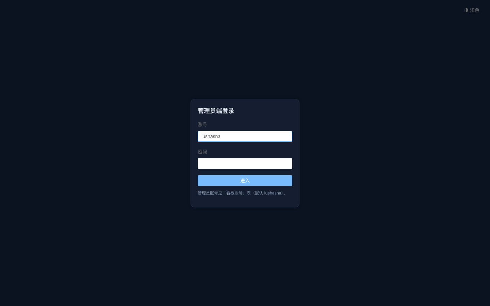
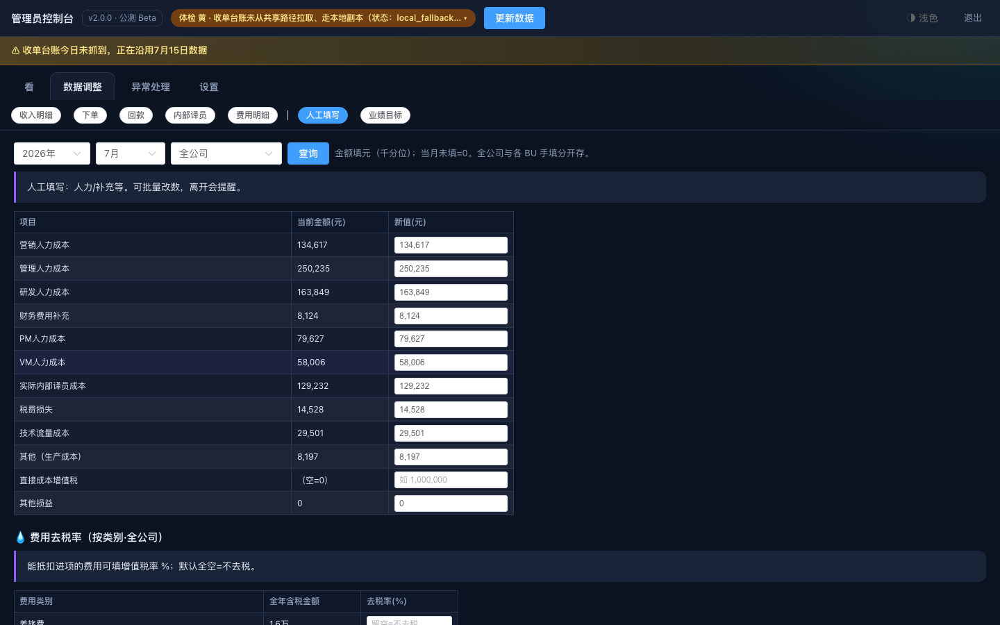
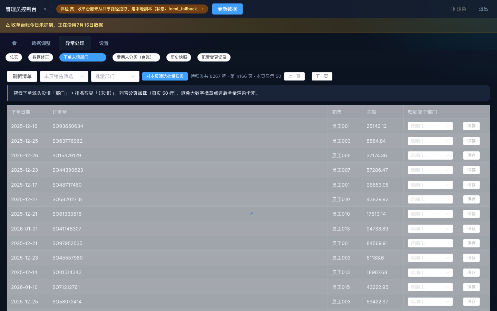
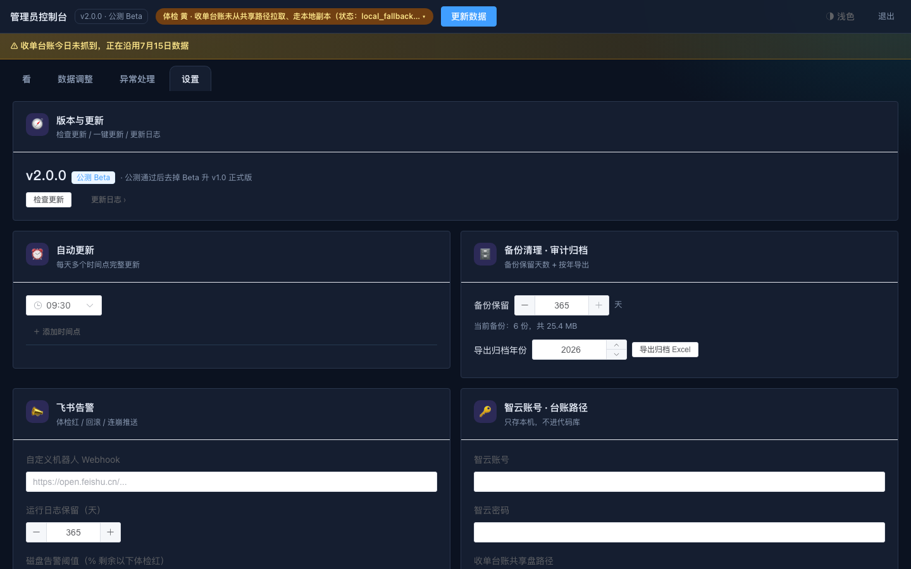

# 管理端操作手册

**这篇解决什么问题**：财务同事用管理员账号，完成「更新数据、改手填、归类异常、管账号」等日常操作。

> 截图为合成数据环境（`http://127.0.0.1:8018/admin`），**零真实数据**。见 `docs/用户手册/截图/`。

---

## 1. 进入管理端

1. 浏览器打开 `…/admin`（本机试用：`http://本机:8018/admin`）。
2. 输入**管理员**账号密码，点 **进入**。
3. 进入后顶部有：看 / 数据调整 / 异常处理 / 设置。

---

## 2. 更新数据（最常用）

1. 顶栏点 **更新数据**（或设置里检查更新相关入口）。
2. 等待跑完；顶栏体检条变绿/黄可看原因。
3. 回到 **看** 页刷新，数字应更新。

> 更新失败时先看黄条提示，再查 `FAQ.md`「黄条是什么意思」。

---

## 3. 数据调整（七个入口）

顶部点 **数据调整**，横向标签包括：

| 标签 | 做什么 |
|------|--------|
| 收入明细 / 下单 / 回款 / 内部译员 / 费用明细 | 查改明细、导出 |
| 人工填写 | 人力等手填金额、分摊比例、去税率 |
| 业绩目标 | 填各月业绩目标 |

**改数规则（务必记住）**：在页面上改明细 = 记一条「调整记录」，下次自动抓数不会冲掉你的改动。

---

## 4. 异常处理

1. 点 **异常处理 → 总览**，看各张卡片上的数字。
2. 例如 **下单未填部门** 有数字时点进去：
   - 列表是**分页**的，可点上一页/下一页；
   - 选部门后点保存；可按销售筛选后批量归类。

---

## 5. 设置（账号与 BU）

1. 点 **设置**。
2. **账号与权限**：增删改账号；管理员至少保留一个。
3. **BU 归属**：把销售划到业务线；保存后会重算。
4. **自动更新时间 / 备份 / 飞书告警**：按公司规范改，改完点底部 **保存全部设置**（有未保存条时才出现）。

---

## 6. 退出

点右上 **退出**。退出后旧页面再操作会提示重新登录。

---

## 还不会？

见 `FAQ.md`，或联系看板维护岗。
