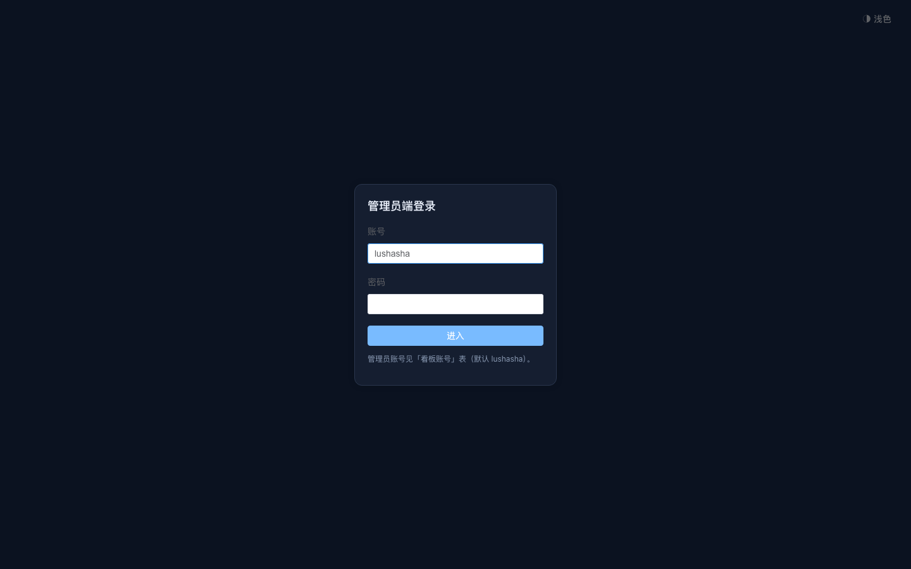
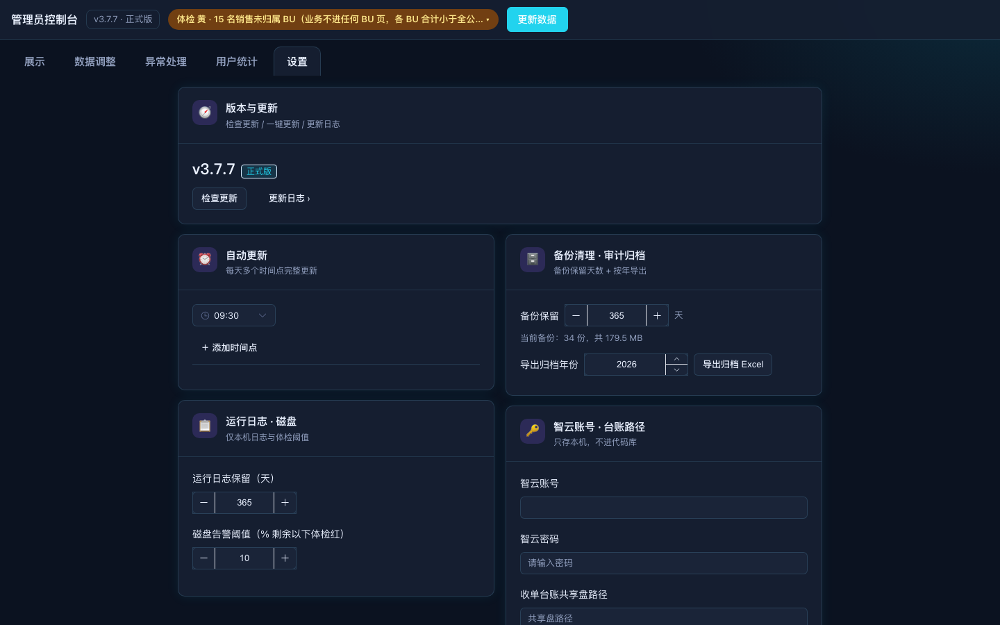

# 管理端操作手册

> **版本对齐（2026-08-03）**：产品 **v3.7.7**（以根 `VERSION` + 项目 `progress.md` 顶部为准）。全员**同一登录页**；会话仅 `kanban_sid`；打开 `/admin` 未登录跳统一登录（可带 `?next=/admin`）；登录后管理员自动进后台。管理端固定深色。一级导航含 **用户统计**（3.3.0+）。设置页**无**飞书 webhook（已废止）。凭据不下发、调度不误报漏跑见 §5（3.7.5）。

**这篇解决什么问题**：财务同事用管理员账号，完成「更新数据、改手填、归类异常、看访问、管账号」等日常操作。

> 截图于 **2026-08-03** 在 `_golden_data` 脱敏环境重采，**零真实客户**。见 `docs/用户手册/截图/` 与 `docs/验收证据/3_7_7/`。登录图=当前「看板登录」统一皮（**不是**旧版「管理员端登录」独立门面）。

---

## 1. 进入管理端

1. 浏览器打开**根地址**或 `…/admin`（本机试用：`http://本机:8018/` 或 `…/admin`）。未登录访问 `/admin` 会跳到统一登录页。
2. 在**同一登录页**输入**管理员**账号密码，点 **进入**（与业务线账号同一入口；**不要**找单独管理员登录网址）。
3. 登录后自动进入管理后台；顶部有：**展示 | 数据调整 | 异常处理 | 用户统计 | 设置**。

---

## 2. 更新数据（最常用）

1. 顶栏点 **更新数据**（或设置里检查更新相关入口）。
2. 等待跑完；顶栏体检条变绿/黄可看原因。
3. 回到 **看** 页刷新，数字应更新。

> 更新失败时先看黄条提示，再查 `FAQ.md`「黄条是什么意思」。

---

## 3. 数据调整（七个入口）

顶部点 **数据调整**，横向标签包括：

| 标签 | 做什么 |
|------|--------|
| 收入明细 / 下单 / 回款 / 内部译员 / 费用明细 | 查改明细、导出 |
| 人工填写 | 人力等手填金额、分摊比例、去税率 |
| 业绩目标 | 填各月业绩目标 |

**改数规则（务必记住）**：在页面上改明细 = 记一条「调整记录」，下次自动抓数不会冲掉你的改动。

---

## 4. 异常处理

1. 点 **异常处理 → 总览**，看各张卡片上的数字（**0=不用管**）。
2. **费用未分类（台账）** 有数字时点进去：处理收单台账未填对应报表大类的费用行（分页 + 表头筛选；保存走调整机制）。
3. **过期疑似 / 调整失配** 点进 **数据修正** 处理。

> **3.7.2 起**：「下单未填部门」产品线已下线（智云部门口径变更后不再按旧部门做归类入口）。排名里空部门仍可能中性显示「（未填）」并置底，**不要求**也不提供「去归类」操作。

---

## 5. 设置（账号与 BU）

1. 点 **设置**。
2. **账号与权限**：增删改账号；管理员至少保留一个。
3. **密码（3.7.5 起 · 凭据不下发）**：
   - 管理员**不能查看**任何人的明文密码；设置页与账号列表 API **永不回显**已存密码。
   - 账号表密码列默认空：**留空保存=不改**；仅新填非空才更新。新账号须填初始密码。
   - 点 **「设新密码」**：必须手输新密码（禁止随机生成后由接口回显）；设置成功后请自行告知同事，**响应不显示明文**。
   - 重置/改密后该账号**旧登录立刻失效**（须用新密码重新登录）。
   - 标 **「初始」** 黄标表示仍是默认初始口令一类，应提醒同事尽快改掉。
   - 看的人（整体/BU）仍可在看板页自改密码（验旧设新）。
   - 智云密码：设置页默认空，提示「已设置；留空不改」；仅明确填入新值才更新。
4. **BU 归属**：把销售划到业务线；保存后会重算。
5. **自动更新时间 / 备份 / 运行日志与磁盘阈值**：按公司规范改，改完点底部 **保存全部设置**（有未保存条时才出现）。**无飞书群推送设置。**
   - 体检条：**未到点的定时槽只算「待执行」**，不会标成「漏跑」；已过点未成功=「待补」；跨日才记「漏跑」。手动「更新数据」成功≠对应定时槽成功。

---

## 6. 退出

点右上 **退出**。退出后旧页面再操作会提示重新登录。

---

## 还不会？

见 `FAQ.md`，或联系看板维护岗。
