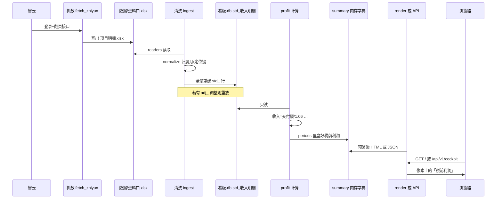
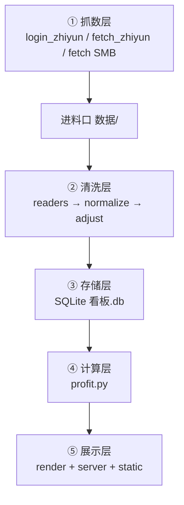
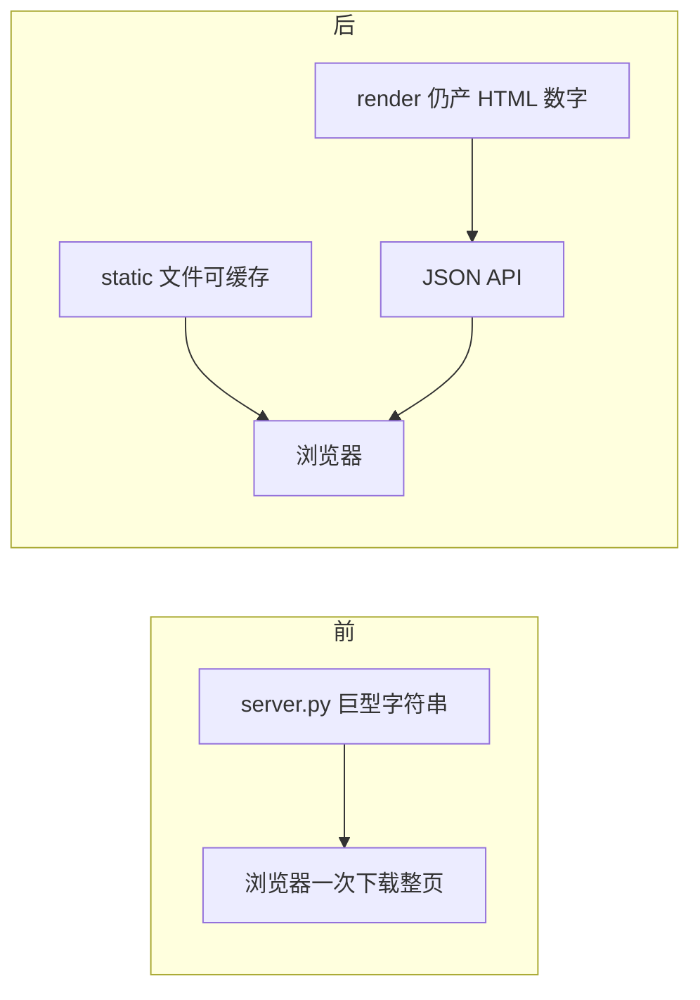
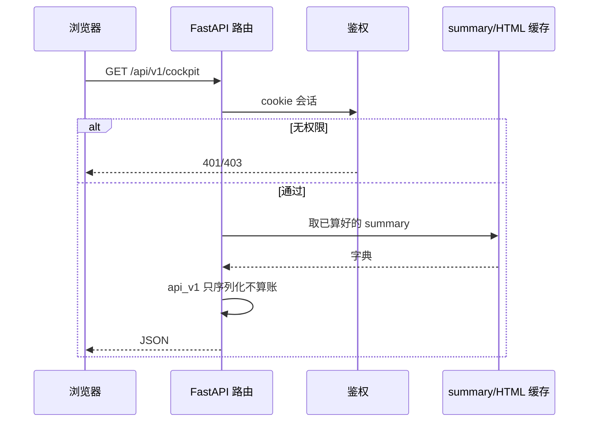
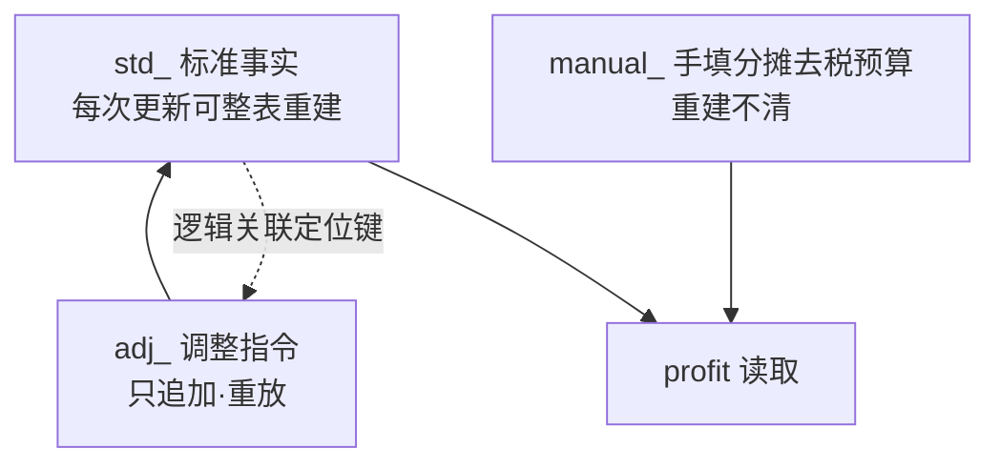
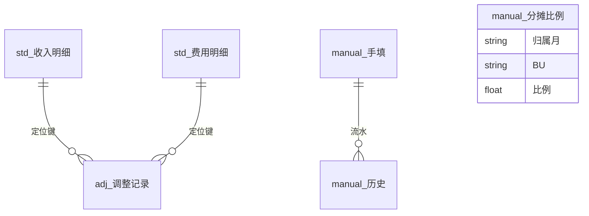
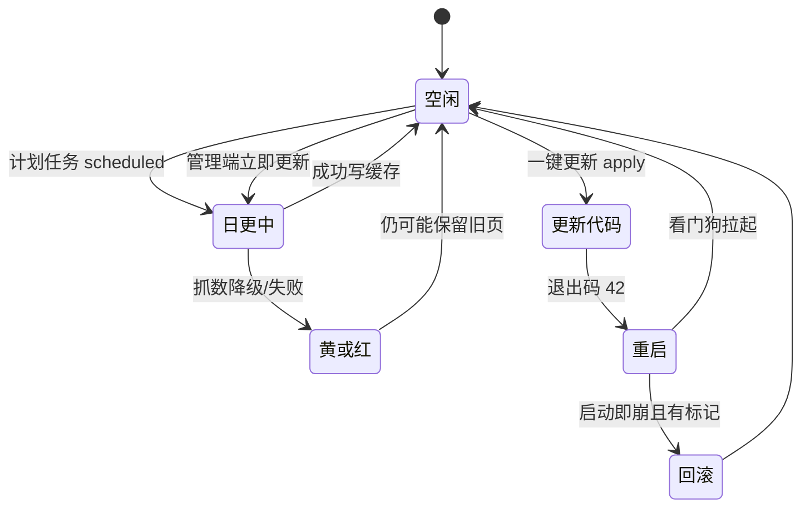
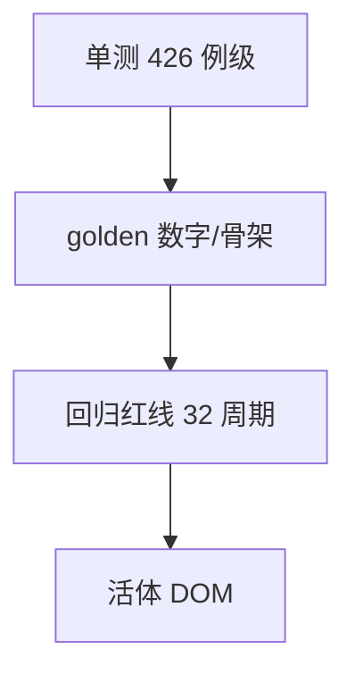
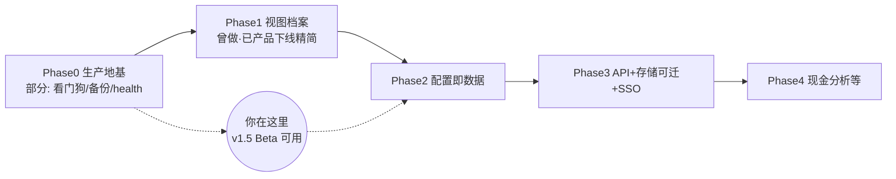

# 系统教学说明 · 甲骨易智能经营罗盘

> **读者**：明昊（财务实习生 + 产品负责人）——懂业务口径、会一点 Python，要系统搞懂这套 Web 工程。  
> **代码版本**：以 **v1.5.0-beta** 前后端全分离为准（`程序/看板正式程序`，约 commit `b9b3f53`）。  
> **写法**：每个技术词第一次出现给**大白话 + 本系统例子**。图用 **mermaid**（GitHub/Gitee 可渲染）。  
> **诚实**：描述以代码为准；例子用假数据概念，**不写真实金额/客户/密码**。

---

## 建议阅读顺序（先看这里）

| 顺序 | 章节 | 建议时长 | 对照代码 |
|------|------|----------|----------|
| 1 | §1 是什么 | 10 分钟 | `README.md` 开头 |
| 2 | §2 一笔钱的旅程 | 30 分钟 | `ingest/` → `profit.py` → `render.py` |
| 3 | §3 五层架构 | 25 分钟 | `CLAUDE.md` 架构块 |
| 4 | §4 前后端分离 | 25 分钟 | `static/`、`api_v1.py`、`server.py` 路由 |
| 5 | §5 数据库 | 20 分钟 | `schema.py` |
| 6 | §6 账号权限 | 15 分钟 | `accounts.py`、`bu.py` |
| 7 | §7 运维 | 20 分钟 | `updater.py`、`.bat` |
| 8 | §8 测试 | 15 分钟 | `tests/run_verify.sh` |
| 9 | §9 铁律故事 | 20 分钟 | `CLAUDE.md` 铁律 |
| 10 | §10 边界与下一步 | 15 分钟 | `05_架构决策与生产化路线图…` |
| 可跳 | 附录术语/文件地图 | 按需 | — |
| 最后 | 附录自测题 | 30 分钟 | 合上文档自答 |

**可跳**：若你只关心业务数字怎么来，读完 §2 + §5 即可上岗查数；工程部署再补 §7。

---

## 1. 这个系统是什么、解决什么问题

### 1.1 业务目标 → 系统答案

| 陆总/姜总要什么 | 系统怎么答 |
|-----------------|------------|
| 脱离 Excel、每天更新 | Windows 机日更管道 + 内网页 |
| 看到税前利润 | `profit` 算管理利润表 |
| 手机也能看 | 响应式 HTML，内网 Wi‑Fi |
| 分级：领导看全、BU 只看本 BU | 账号登录分流，服务端过滤 |
| 能改错数、填人力 | 管理端调整记录 + 手填 |


**看图要点**：系统不是「做个好看的表」，而是**进数 → 算账 → 给人看 → 每天自己跑**闭环。

---

## 2. 一笔钱的旅程（全书主线）

我们跟一条假想链路（**数字仅为示意**，非真实客户）：

> 智云项目明细里有一笔「交付额」→ 最终影响页面「税前利润」。



**看图要点**：

1. **浏览器从不直接读库**——只跟 HTTP 要结果。  
2. **算账只在 Python**——前端只切换已算好的块。  
3. **进料口是文件夹**——抓数失败时还可沿用上次 xlsx。

后面每章都会说：这一层在这条链上的哪一环。

---

## 3. 五层架构逐层拆



| 层 | 代码在哪 | 设计原因（大白话） |
|----|----------|-------------------|
| 抓数 | `src/ingest/fetch_zhiyun.py` 等 | 把别人系统的数**搬回家**；搬不到就用家里旧的 |
| 进料口 | `数据/*.xlsx` | **唯一接缝**：换来源只改搬家方式，后面算账不动 |
| 清洗 | `normalize.py` `adjust.py` | 日期金额对齐；陆总改过的数**重放**不丢 |
| 存储 | `schema.py` `db.py` | 标准事实 vs 人工指令分开；库是**后端私产** |
| 计算 | `profit.py` | 纯函数：同样输入必出同样税前利润 |
| 展示 | `render.py` `server.py` `static/` | 人看的页面；**前端零金额运算** |

**路由**是什么？——浏览器地址里路径与「服务器哪个函数响应」的对应。  
例：打开 `/bu/游戏` → `server.py` 里 `@app.get("/bu/{name}")` 接到，并检查你能不能看「游戏」这个 BU。

---

## 4. 前后端分离到底分了什么（v1.4 / v1.5）

### 4.1 分离前后对比

| | 分离前 | v1.4 看端 | v1.5 管理端 |
|--|--------|-----------|-------------|
| CSS/JS | 塞进 Python 大字符串 | `static/css` `static/js` | `static/admin/*` |
| 数据给前端 | 主要整页 HTML | 另增 `/api/v1/cockpit` JSON | 仍走原有 `/api/*` |
| 观感 | — | 搬家不装修 | 同左 |
| 回退 | — | git checkout 旧 commit | 已无 LEGACY 环境变量 |



### 4.2 一次 HTTP 请求生命周期

**HTTP** = 浏览器和服务器约定好的「要东西/回东西」的规矩（像填快递单）。



### 4.3 shell fetch

整体页登录后，先拿到很轻的 `static/shell.html`，再 `fetch('/api/v1/cockpit/fragments')` 用 `page.js` 组装驾驶舱 HTML——**像先拿信封再装信**（B-P5 已删旧的整页 view 路径）。BU 页为隔离仍常直接出 HTML。

### 4.4 `/api/v1/*` 与飞书以后

| 端点 | 干嘛 |
|------|------|
| session / login / logout | 登录态 |
| cockpit | 全公司数字 JSON |
| cockpit/bu/{name} | 单 BU |
| cockpit/fragments | 渲染就绪碎片（page.js 组装） |

飞书机器人（规划）：内网会话下 `GET /api/v1/cockpit`，读 `numbers` 里税前利润推送——**不要刮 HTML**。

权威全表：`软件工程文档/2_设计/07_HTTP接口清单_全端点.md`（**55** 个装饰器路由）。

---

## 5. 数据库

### 5.1 三类表



**哲学**：源头系统的数 vs 陆总改的数 vs 陆总填的数——**三本账不能糊成一本**，否则重抓必丢改动。

### 5.2 有哪些表（从 schema 数：**15**）

- std：收入明细、下单、回款、内部译员、费用明细（5）  
- adj：调整记录（1）  
- manual/meta：手填、手填BU、分摊比例、去税率、历史、预算、预算历史、运行日志、配置变更（9）  

详表：`2_设计/08_数据库设计_schema全表.md`。



**会话（session）**是什么？——你登录后服务器塞给你的「通行证」（本系统用 **cookie** 记在浏览器里），以后请求自动带上，不用每点一下都输密码。

---

## 6. 账号权限与隔离

```mermaid
flowchart TD
  L[POST /login 账号密码] --> A{权限?}
  A -->|管理员| ADM[/admin 控制台]
  A -->|整体| MAIN[整体驾驶舱 + BU 入口]
  A -->|BU| BU[/bu/某BU 仅本 BU 数据]
```

**铁律12（大白话）**：BU 页只能吃**已经按销售名单滤过的**数字；不能去调「全公司按天明细」那种接口，否则会看见别人的数。

代码：`accounts.can_see_bu` / `bu_names_of`；`server` 里 `/api/daily` 对 BU 会话 401。

---

## 7. 每天怎么活着（运维）



### 排查决策树（精简）

| 现象 | 先查 |
|------|------|
| 页面空白 | 浏览器 F12 控制台/网络 404；管理端是否 Ctrl+F5；重复 id |
| 数字不对 | 管理端体检；该月手填是否 0；调整是否过期疑似；进料口文件日期 |
| 更新失败 | refresh_status；智云账号；台账路径；看门狗是否在跑 |

部署关系：`2_设计/09_部署架构说明.md`。

---

## 8. 测试是怎么保住这个系统的



| 层 | 防什么 | 真实故事 |
|----|--------|----------|
| 单测 | 函数/鉴权写错 | — |
| golden | API 数字漂移 | v1.4 numbers≡baseline |
| 红线 | 入库破坏利润 | 库算必须==文件算 |
| 活体 | 页空白假绿 | **dTbl 撞车**：接口有数、页面空白 |
| 退出码 | 管道假绿 | **`\| tail` 把失败吞成 0** |

详见：`3_测试/07_测试策略四层防线.md`。

---

## 9. 踩坑博物馆（铁律故事精选）

| 铁律 | 当时发生了什么 | 规矩 |
|------|----------------|------|
| 智云 xlsx 禁 `read_only` | dimension 撒谎只读 1 行 | 完整 load |
| 前端零运算 | 客户端一算口径就漂 | 只切换预渲染 |
| 回归红线 | 重构怕数字悄悄变 | 库 vs 文件全等 |
| 自由文本转义 | 台账 XSS/乱码 | 进 HTML 必 esc |
| 口令 bytes 比较 | 中文密码 500 | encode 再 compare_digest |
| BU 严格隔离 | 动态 API 可越权看他 BU | 会话闸+过滤 summary |
| fixed 弹窗挂 body | transform 祖先困住浮层 | modal 挂 body |
| 一键更新只 ff | 乱合并毁部署机 | pull --ff-only + 回滚 |
| 不写 config.json | 脏工作区导致更新死 | 本地配置.json 覆盖 |
| 判绿禁 tail | 假绿推远端 | 看真实退出码 |

完整 20 条：`程序/看板正式程序/CLAUDE.md`。

---

## 10. 现状边界与下一步

### 10.1 已做到 / 未做到（诚实）

| 已建 ✅ | 未建/边界 ⏳ |
|---------|----------------|
| 五层管道、日更、双端、BU、分摊、去税 | 飞书 SSO、Postgres、公网 HTTPS |
| 看端+管理端 static 分离 | 登录页仍可内嵌小页 |
| golden + 红线 + 大量单测 | CI 全自动活体浏览器未默认 |
| 一键更新+看门狗回滚 | 密码明文（内网可接受） |

### 10.2 你在生产化路线图的哪里

对照 `2_设计/05_架构决策与生产化路线图_20260714.md`（Phase0~4）：



### 10.3 明昊视角下一步建议

| 优先 | 做什么 | 解决问题 | 工作量感 | 谁拍板 |
|------|--------|----------|----------|--------|
| 1 | 清体检黄：销售 BU 归属配齐 | 各 BU 合计&lt;全公司 | 配置 0.5 天 | 陆总映射已有 |
| 2 | shell 401 跳 `/` | 会话过期死链 | 改 1 行 | 你 |
| 3 | 译员专用账号 | 成本更准 | 等账号 | 陆总 |
| 4 | CI 真实退出码+冒烟 | 防假绿 | 1~2 天 | 你 |
| 5 | 密码哈希/SSO | 安全升级 | 按路线图 Phase3 | 公司 IT/陆总 |

---

## 附录 A · 术语表

| 词 | 大白话 | 本系统例子 |
|----|--------|------------|
| HTTP | 浏览器与服务器要数据的规矩 | `GET /api/health` |
| 路由 | URL 路径对应哪个处理函数 | `/bu/游戏` |
| 会话/cookie | 登录后的通行证 | `kanban_session` |
| 序列化 | 把内存对象变成 JSON 文本 | `api_v1.cockpit_payload` |
| 静态文件 | 不经算账直接下发的 css/js | `/static/admin/admin.css` |
| 进料口 | 原始文件落地目录 | `数据/项目明细.xlsx` |
| 预渲染 | 服务端先算好 HTML 块 | `.pv` 周期块 |
| 回归红线 | 两条算法数字必须一样 | 库算 vs 文件算 |
| 看门狗 | 进程挂了自动再拉起的脚本 | `看门狗启动.bat` |
| ff-only | 只允许快进拉取，禁止乱合并 | 一键更新护栏 |

## 附录 B · 文件地图（关键）

| 路径 | 一句话 |
|------|--------|
| `run.py` | 入口：更新 / 服务 / 计划任务 |
| `src/profit.py` | 税前利润怎么算 |
| `src/ingest/` | 抓数+清洗管道 |
| `src/schema.py` | 全部表结构 |
| `src/server.py` | 所有 HTTP 路由 |
| `src/api_v1.py` | 驾驶舱 JSON |
| `src/render.py` | 用户端 HTML 拼装 |
| `static/` | 看端 CSS/JS/壳 |
| `static/admin/` | 管理端 CSS/JS/HTML |
| `tests/` | 自动化测试 |
| `docs/` | 部署/交付/API 说明 |

## 附录 C · 自测题 20 道（答案在后）

1. 进料口为什么是文件夹而不是直接写库？  
2. 浏览器能打开 `看板.db` 吗？为什么？  
3. 陆总改了一笔交付月份，重抓后为什么还能在？  
4. 前端切换「2026年 / Q2」时会不会重新算利润？  
5. `/api/v1/cockpit` 和 HTML 驾驶舱数字谁权威？  
6. BU 账号调用 `/api/daily` 会怎样？  
7. `std_` 和 `manual_` 重建时谁会被清空？  
8. 当月手填没填，现在按什么算？  
9. 去税率空着时费用变不变？  
10. 分摊比例合计 80% 时剩下 20% 去哪？  
11. 一键更新为什么禁止工作区脏？  
12. 退出码 42 是什么意思？  
13. dTbl 撞车说明单测有什么盲区？  
14. `run_verify | tail` 为什么危险？  
15. 管理端 v1.5 静态文件在哪个目录？  
16. v1.5+ 管理端静态资源唯一源在哪个目录？  
17. 附加税费代码用的增值税基数是含税还是不含税收入？  
18. 账号密码存在哪？是否进 git？  
19. 管道抓数失败会不会让服务直接挂掉？  
20. 陆总说「6 月房租不对」，你查数顺序？  

### 答案

1. 接缝清晰：换抓取方式不动下游；失败可沿用旧文件。  
2. 不能当接口用：库是后端私产，只经 HTTP。  
3. 写入 `adj_调整记录`，清洗时重放。  
4. 不会；只显示预渲染块。  
5. 同源 summary；API 是序列化，应对齐 golden。  
6. 401，防越权。  
7. 只重建 `std_`；manual/adj 不清。  
8. **0**（不再沿用上月）。  
9. 不变（恒等）。  
10. 留公司层/公共残留。  
11. 否则 pull 可能覆盖未提交改动或失败。  
12. 告诉看门狗：请用新代码重启我。  
13. 接口有数≠DOM 渲染对；要活体看页面。  
14. 退出码变成 tail 的 0，假绿。  
15. `static/admin/`。  
16. 管理端改回内嵌整页 HTML。  
17. **不含税收入**（×6% 得增值税再×12%）。  
18. `数据/看板账号.json`，gitignore 不进 git。  
19. 一般不：降级黄灯，管道尽量继续。  
20. 体检 → 台账该月房租行 → 去税率是否误填 → 分摊是否影响 BU 视图 → 调整台账是否过期 → 进料口文件是否最新。

---

## 文档维护

- 接口增删：重数 `server.py` 装饰器并改 `07_HTTP接口清单`。  
- 表结构变：以 `schema.py` 为准改 `08_数据库设计`。  
- 版本升级：改文首版本号与 §10 现状表。
